# ADO.NET笔记

视频链接：[C#之ADO.NET数据库操作技术](https://www.bilibili.com/video/BV1124y1K726/?share_source=copy_web&vd_source=1faf6f8be863497a8aa161f8493e14d2)(这个视频的水印：北盟网校 www.bamn.cn)

ADO.NET是.NET操作数据库的一个模块的总称，我们通过它来操作数据库，对数据库进行增删改查等等操作。还可以**执行sql语句**，**调用SQL里面的函数** **执行存储过程**等等。我们很多大型的业务系统都是离不开数据库，我们需要把一些数据固化到本地，并且想要方便查找的话，那么就需要使用数据库了。

ADO主要就是提供一些对象，这些对象封装了一些操作数据库的一些方法。比如Connection Command DataSet DataReader 它们每个都有自己的功能。**Connection**

是用来对数据进行连接 

**Command**

主要是执行SQL的命令等。

**DataSet**

它其实是一个数据的集合，它是对数据库进行一个抽象，我们操作这个DataSet就好像操作数据一样。DataSet里面就包含DataTable（表）DataRow对应表中的一条记录

**DatAdapter**

相当于数据库的一个适配器

学习这个ADO.NET我们才能开发一些更强大的业务系统，包括我们的网站都是离不开数据库的。

ORM框架，EF     ibatis      nhibenatie      linq to entity这些底层都是ADO.NET

## 02节-数据库连接Connections 

**Connections 用户和数据库进行连接 是数据库操作的桥梁**

.NET 提供了 SqlConnection 这个类给我们，命名空间是 System.Data.SqlClient 类集是 System.Data.dll。我们和数据库有关的东西都基本在这个 dll 里面封装的

在连接之前我们首先需要准备数据库的连接字符串，因为我们在创建对象的时候需要用到

```csharp
SqlConnection conn = new SqlConnection (connectionString)
```

### **连接字符串**

其实就是一个字符串来的，用 string 来保存。下面应该是以SQL Sever 数据库为主进行讲解的。

#### 两种登录方式

**1、sa 登陆：(账号密码登录)**

```csharp
"Data Source=.;Initial Catalog=dbtest;User ID=sa;pwd=123456;"
```

**2、windows 登陆（这个可能只有SQL SEVER有）**

```csharp
Data Source=.;Initial Catalog = 数据库;Integrated Security=True
```

#### 连接字符串组成

1. 字符串中由多部分组成，各部分用英文分号隔开
2. 每一个值用 = 来隔开 
3. Data Source 表示数据库地址，如果是本地 通常可以用 (local) 127.0.0.1 或者[.]英文句号来表示，如果是远程服务器则可能可以用域名或者IP地址。
4. Initial Catalog 后面跟着的是数据库名
5. User ID 后面跟着的是数据库账号
6. pwd 后面是数据库密码
7. 当然 User ID 和 pwd 不是必须的。如果是使用 windows 登录 则可以用 Integrated Security=True 集成安全模式
8. 连接字符串可以在Visual Studio 添加数据库连接中配置

   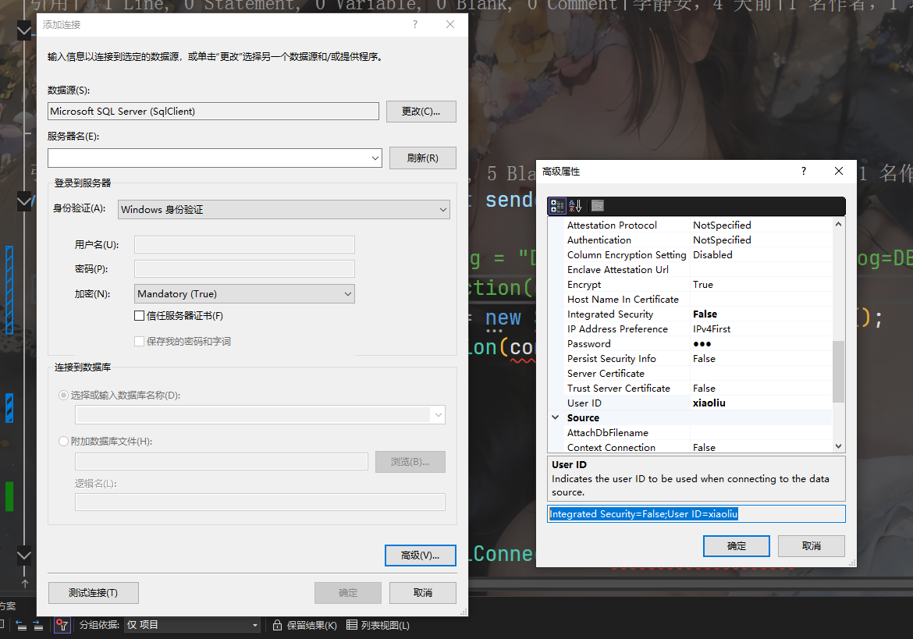

#### Tips

1. **连接字符串的顺序是没有要求，SQLServer是这样子的，其他数据库不是特别清楚。**
2. 连接字符串参考网址：[[连接字符串 - ADO.NET Provider for SQL Server | Microsoft Learn](https://learn.microsoft.com/zh-cn/sql/connect/ado-net/connection-strings?view=sql-server-ver16)](https://learn.microsoft.com/zh-cn/dotnet/api/system.data.sqlclient.sqlconnection.connectionstring?view=net-8.0-pp)
3. System.Data.SqlClient 包现已弃用,建议使用 Microsoft.Data.SqlClient 

#### 远程数据库连接

[配置SQLServer，远程连接 （超详细）_sqlserver配置远程连接-CSDN博客](https://blog.csdn.net/yanghezheng/article/details/114298590)

正确写法：

```csharp
 //builder.DataSource = ".";
 //builder.DataSource = "tcp:1116-SL,1433";//这个字符串可以连上
 //builder.DataSource = "tcp:(local)";//这个也可以，之前不行可能是未配置防火墙的原因
 //builder.DataSource = "np:(local)";//OK
 //builder.DataSource = @"1116-SL";//OK
 //builder.DataSource = "1116-SL,1433";//OK
 //builder.DataSource = "tcp:1116-SL";//OK
 //builder.DataSource = @"tcp:127.0.0.1,1433";//OK
 //builder.DataSource = "127.0.0.1,1433\\MSSQLSERVER";//OK,那还是相当于我被主机名给误导了
 //主机名要么是IP地址，要么是主机名
```

##### 实例名是什么？

在 SQL Server 里，实例名称是用来标识在同一台物理服务器上运行的不同 SQL Server 安装的标识符。一台物理服务器能够同时运行多个 SQL Server 实例，每个实例都拥有独立的配置、数据库和服务。以下为你详细介绍：

###### 实例名称的用途

- **区分不同安装**：借助实例名称，可在同一台服务器上区分不同的 SQL Server 安装。比如，一台服务器上可能同时运行着用于生产环境和开发环境的 SQL Server 实例，它们分别使用不同的实例名称。
- **独立配置**：每个实例都有自己独立的配置，像内存分配、安全设置、网络协议等。通过实例名称，你可以针对不同的实例进行个性化的配置。
- **数据库管理**：每个实例可以有自己的一组数据库。你可以依据不同的业务需求，在不同的实例中创建和管理数据库。

###### 实例名称的格式和示例

- **默认实例**：如果在安装 SQL Server 时选择了默认实例，那么实例名称通常是省略的，或者简单地用服务器名称来表示。例如，服务器名为 `SERVER01`，默认实例就可以通过 `SERVER01` 来访问。
- **命名实例**：若安装时选择了命名实例，就需要为实例指定一个名称。实例名称会跟随在服务器名称后面，用反斜杠 `\` 分隔。例如，服务器名为 `SERVER01`，实例名称为 `SQLDEV`，那么完整的实例标识符就是 `SERVER01\SQLDEV`。

###### 如何查看实例名称

1. 第一种通过服务配置中心查看
   1. 按下 `Win + R` 组合键，打开 “运行” 对话框，输入 `SQLServerManager<版本号>.msc`（例如 SQL Server 2019 对应的是 `SQLServerManager15.msc` ），回车后打开 SQL Server 配置管理器。
   2. 在左侧面板中展开 “SQL Server 服务”。
   3. 你会看到正在运行的 SQL Server 实例，服务名称格式通常为 `SQL Server (<实例名>)`，括号内的就是实例名。若服务名称为 `SQL Server (MSSQLSERVER)`，则表明是默认实例。、
2. 第二种通过SSMS查看
   1. 打开 SSMS，在 “连接到服务器” 对话框中，“服务器名称” 下拉框里会显示已发现的 SQL Server 实例，若已连接到某个实例，在对象资源管理器的顶部也能看到当前连接的服务器名称（包含实例名）。

### 主键自增配置

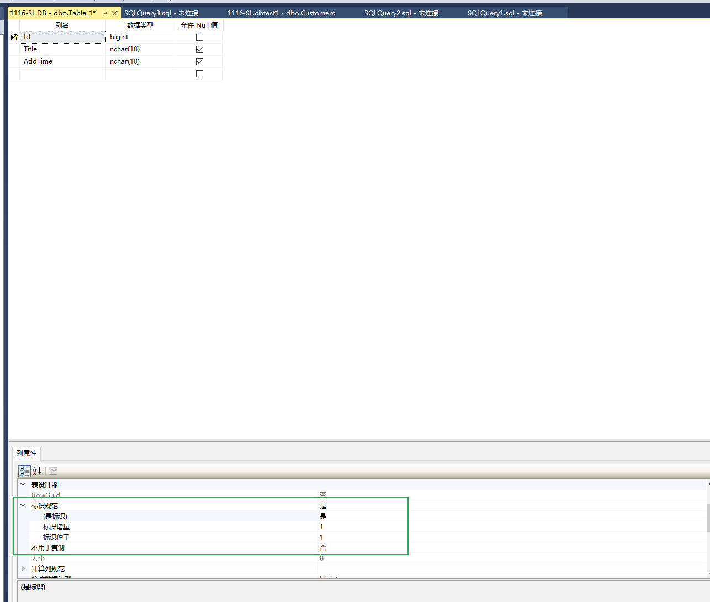

### 使用SSMS操作数据库，不可以修改表，报错原因

1. 工具，选项

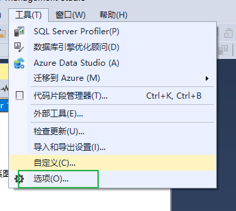

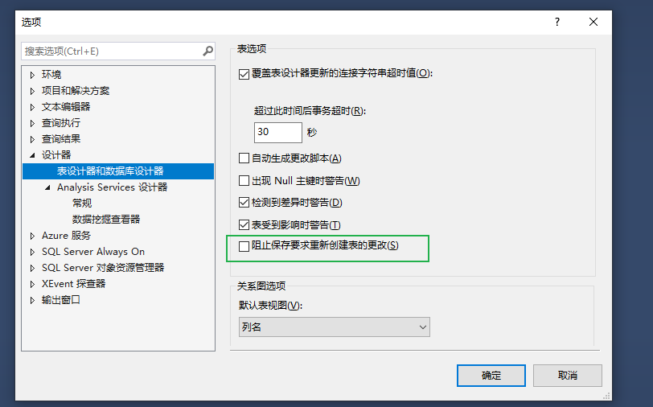


### SqlCommand

#### 常用方法

| 项                                                           | 说明                                                         |
| :----------------------------------------------------------- | :----------------------------------------------------------- |
| [BeginExecuteNonQuery](https://learn.microsoft.com/zh-cn/dotnet/api/microsoft.data.sqlclient.sqlcommand.beginexecutenonquery?view=sqlclient-dotnet-standard-5.2) | 启动此 [SqlCommand](https://learn.microsoft.com/zh-cn/dotnet/api/microsoft.data.sqlclient.sqlcommand?view=sqlclient-dotnet-standard-5.2)描述的 Transact-SQL 语句或存储过程的异步执行，通常执行 INSERT、DELETE、UPDATE 和 SET 语句等命令。 对 的每个调用 [BeginExecuteNonQuery](https://learn.microsoft.com/zh-cn/dotnet/api/microsoft.data.sqlclient.sqlcommand.beginexecutenonquery?view=sqlclient-dotnet-standard-5.2) 都必须与完成操作的调用配对，该调用 [EndExecuteNonQuery](https://learn.microsoft.com/zh-cn/dotnet/api/microsoft.data.sqlclient.sqlcommand.endexecutenonquery?view=sqlclient-dotnet-standard-5.2) 通常在单独的线程上完成操作。 |
| [BeginExecuteReader](https://learn.microsoft.com/zh-cn/dotnet/api/microsoft.data.sqlclient.sqlcommand.beginexecutereader?view=sqlclient-dotnet-standard-5.2) | 启动由此 [SqlCommand](https://learn.microsoft.com/zh-cn/dotnet/api/microsoft.data.sqlclient.sqlcommand?view=sqlclient-dotnet-standard-5.2) 描述的 Transact-SQL 语句或存储过程的异步执行，并从服务器检索一个或多个结果集。 对 的每个调用 [BeginExecuteReader](https://learn.microsoft.com/zh-cn/dotnet/api/microsoft.data.sqlclient.sqlcommand.beginexecutereader?view=sqlclient-dotnet-standard-5.2) 都必须与完成操作的调用配对，该调用 [EndExecuteReader](https://learn.microsoft.com/zh-cn/dotnet/api/microsoft.data.sqlclient.sqlcommand.endexecutereader?view=sqlclient-dotnet-standard-5.2) 通常在单独的线程上完成操作。 |
| [BeginExecuteXmlReader](https://learn.microsoft.com/zh-cn/dotnet/api/microsoft.data.sqlclient.sqlcommand.beginexecutexmlreader?view=sqlclient-dotnet-standard-5.2) | 启动此 [SqlCommand](https://learn.microsoft.com/zh-cn/dotnet/api/microsoft.data.sqlclient.sqlcommand?view=sqlclient-dotnet-standard-5.2) 描述的 Transact-SQL 语句或存储过程的异步执行。 对 的每个调用 `BeginExecuteXmlReader` 都必须与对 `EndExecuteXmlReader`的调用配对，该调用通常会在单独的线程上完成操作，并返回 一个 [XmlReader](https://learn.microsoft.com/zh-cn/dotnet/api/system.xml.xmlreader) 对象。 |
| [ExecuteReader](https://learn.microsoft.com/zh-cn/dotnet/api/microsoft.data.sqlclient.sqlcommand.executereader?view=sqlclient-dotnet-standard-5.2) | 执行返回行的命令。 为了提高性能， [ExecuteReader](https://learn.microsoft.com/zh-cn/dotnet/api/microsoft.data.sqlclient.sqlcommand.executereader?view=sqlclient-dotnet-standard-5.2) 使用 Transact-SQL `sp_executesql` 系统存储过程调用命令。 因此， [ExecuteReader](https://learn.microsoft.com/zh-cn/dotnet/api/microsoft.data.sqlclient.sqlcommand.executereader?view=sqlclient-dotnet-standard-5.2) 如果用于执行 Transact-SQL SET 语句等命令，则可能不会产生所需的效果。 |
| [ExecuteNonQuery](https://learn.microsoft.com/zh-cn/dotnet/api/microsoft.data.sqlclient.sqlcommand.executenonquery?view=sqlclient-dotnet-standard-5.2) | 执行 Transact-SQL INSERT、DELETE、UPDATE 和 SET 语句等命令。 |
| [ExecuteScalar](https://learn.microsoft.com/zh-cn/dotnet/api/microsoft.data.sqlclient.sqlcommand.executescalar?view=sqlclient-dotnet-standard-5.2) | 检索单个值 (例如，从数据库) 聚合值。求和，计数等。           |
| [ExecuteXmlReader](https://learn.microsoft.com/zh-cn/dotnet/api/microsoft.data.sqlclient.sqlcommand.executexmlreader?view=sqlclient-dotnet-standard-5.2) | 将 [CommandText](https://learn.microsoft.com/zh-cn/dotnet/api/microsoft.data.sqlclient.sqlcommand.commandtext?view=sqlclient-dotnet-standard-5.2) 发送到 [Connection](https://learn.microsoft.com/zh-cn/dotnet/api/microsoft.data.sqlclient.sqlcommand.connection?view=sqlclient-dotnet-standard-5.2)，并生成一个 [XmlReader](https://learn.microsoft.com/zh-cn/dotnet/api/system.xml.xmlreader) 对象。 |

参考链接：[SqlCommand 类 (Microsoft.Data.SqlClient) | Microsoft Learn](https://learn.microsoft.com/zh-cn/dotnet/api/microsoft.data.sqlclient.sqlcommand?view=sqlclient-dotnet-standard-5.2&devlangs=csharp&f1url=%3FappId%3DDev17IDEF1%26l%3DZH-CN%26k%3Dk(Microsoft.Data.SqlClient.SqlCommand)%3Bk(SolutionItemsProject)%3Bk(SolutionItemsProject)%3Bk(DevLang-csharp)%26rd%3Dtrue)

#### ExecuteNonQuery

int rows = command.ExecuteNonQuery();//返回受影响的行数。适合非查询的操作。

### 设置超时时间(SqlCommand)

```csharp
command.CommandTimeout = 10;//默认是30秒
```

### 判断连接是否已开启（SqlConnection）

```csharp
if(conn.State!=ConnectionState.Open) conn.Open(); 
```

### 设置命令参数（SqlCommand）

有时候我们的Sql语句中需要传入参数，并不是固定写死的。

**写死的命令**

```csharp
command.CommandText = "select 1";
```


# SQL Server 数据库

## 修改数据库连接密码

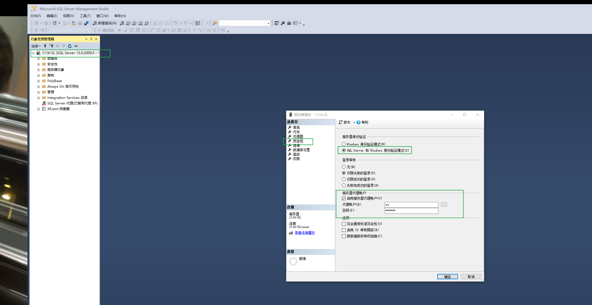

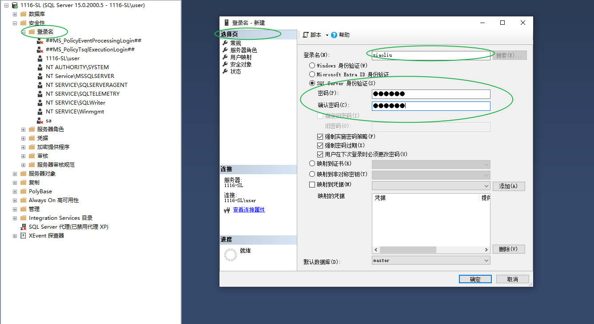

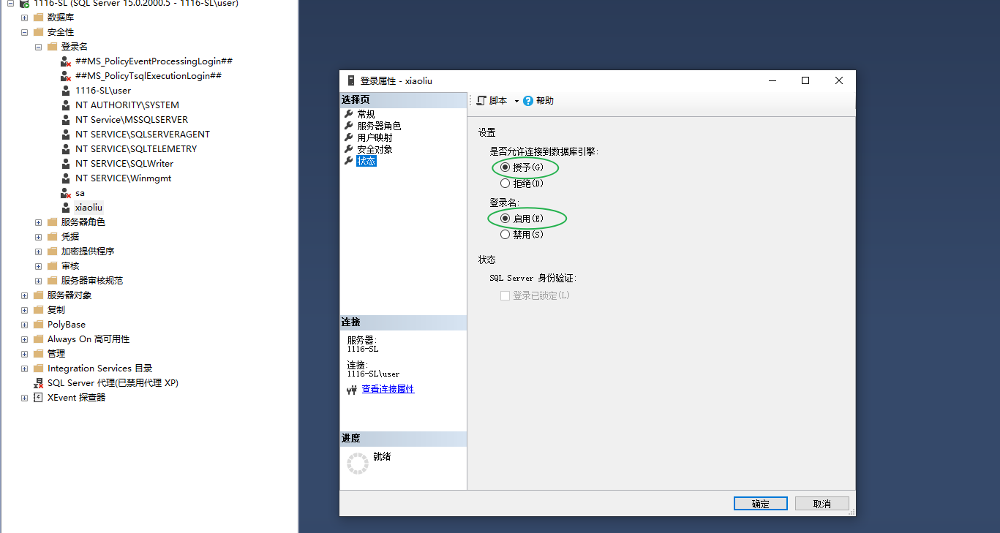

重启服务，正常连接，需要信任服务器证书

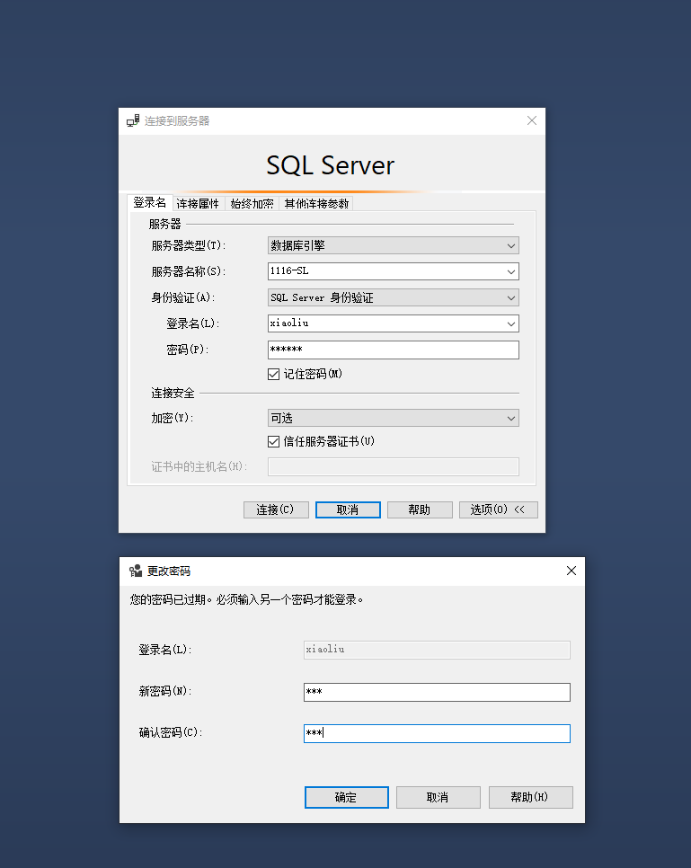

参考链接1：[SqlServer密码修改超级详细_sqlserver修改密码-CSDN博客](https://blog.csdn.net/qq_33435148/article/details/120680216)

参考链接2：[只需3步，修改SQLServer的sa密码-CSDN博客](https://blog.csdn.net/TheToysOfTown/article/details/121910417)

### 这样创捷出来的账户遇到了权限问题

账号：xiaoliu操作什么数据库都操作不了

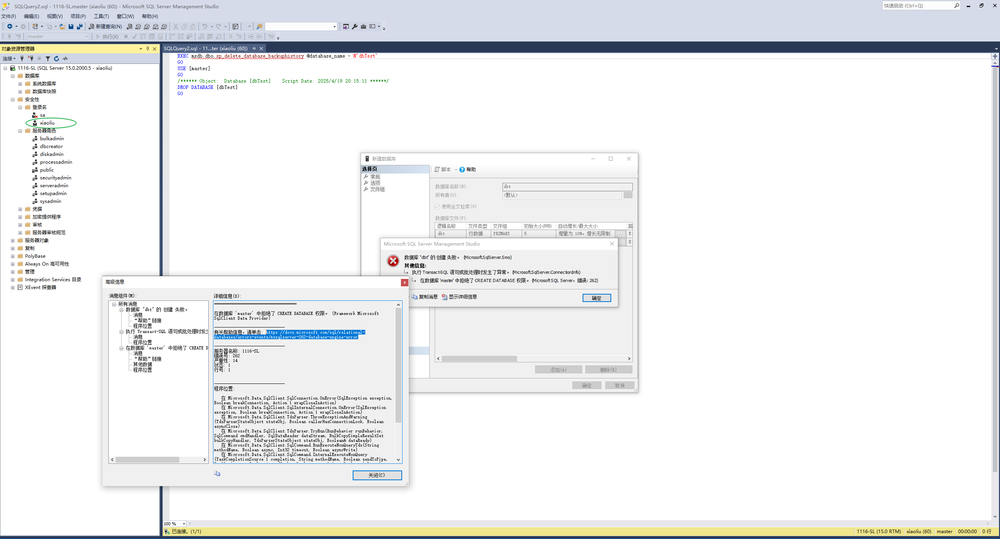

数据库权限参考链接：[SQL Server 权限管理 - pursuer.chen - 博客园](https://www.cnblogs.com/chenmh/p/4080420.html)

数据库权限参考链接：[一学就会的Sql Server数据库权限管理_sql 表属性权限-CSDN博客](https://blog.csdn.net/Friendsofthewind/article/details/111941382)

#### 设置服务器权限

第一个像是预设

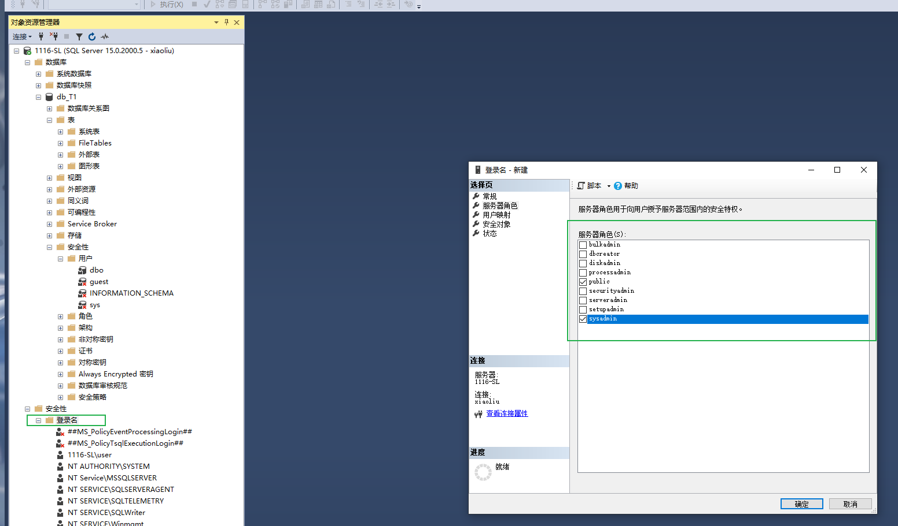

下面这个像是对单个权限进行设置

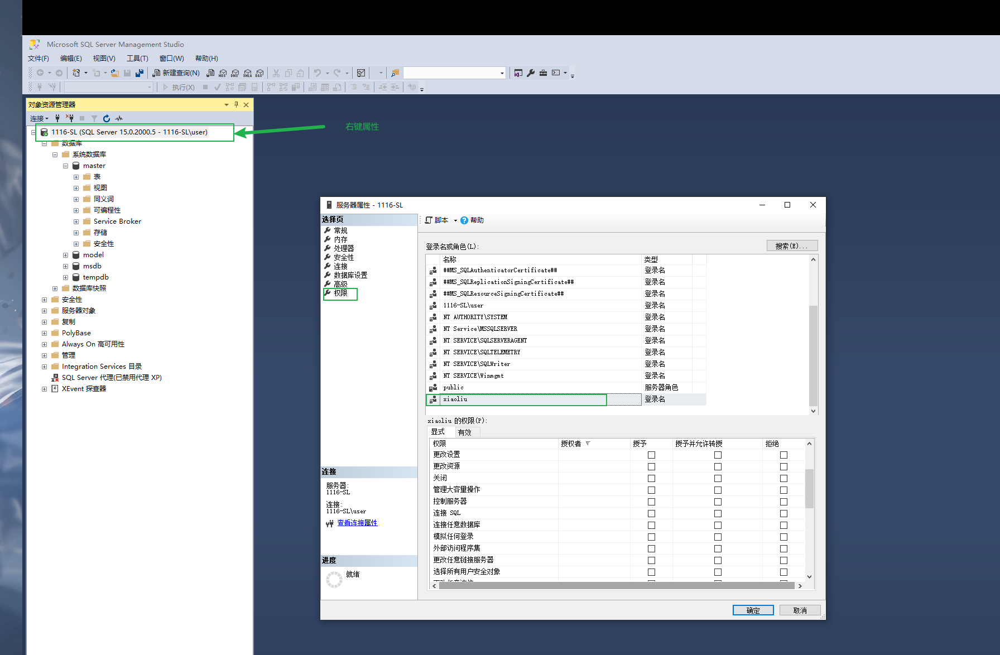

#### **新建数据库用户**

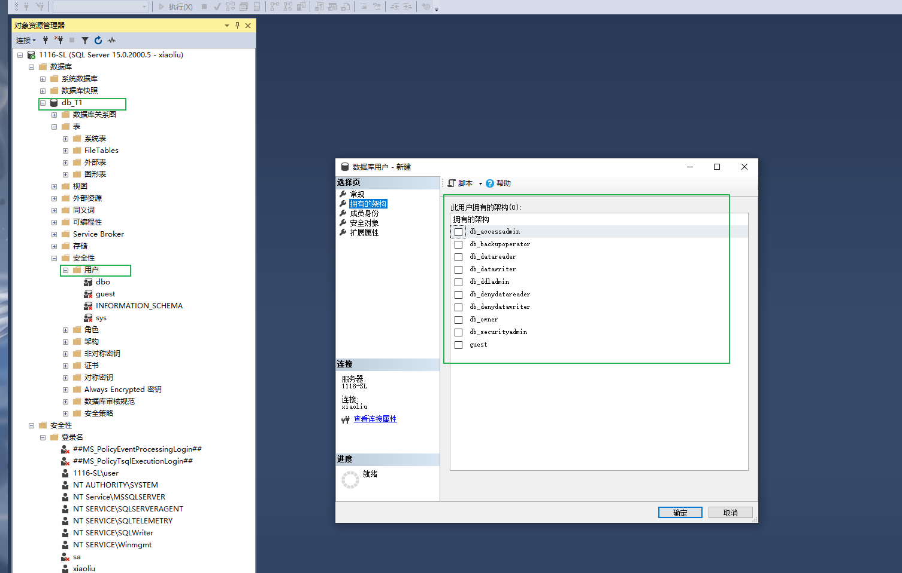

登录名只能选择现有的

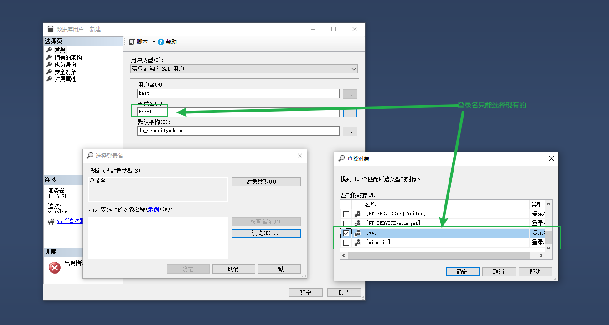

## 数据迁移

使用 **Microsoft.EntityFrameworkCore.Tools **迁移数据到Sql Server

1. 在程序包管理器中使用Add-Migration 创建迁移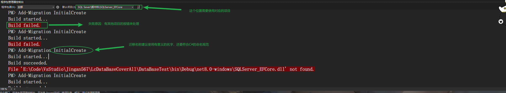

2. 注意设置启动项目

   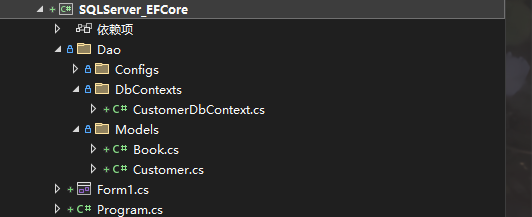

3. 注意观察报错信息

   ```cmd
   PM> add-migration InitCreate
   Build started...
   Build succeeded.
   File 'E:\Code\VsStudio\Jingan567\LcDataBaseCoverAll\DataBaseTest\bin\Debug\net8.0-windows\SQLServer_EFCore.dll' not found.
   PM> add-migration InitCreate
   Build started...
   Build succeeded.
   Unable to create a 'DbContext' of type 'CustomerDbContext'. The exception 'Keyword not supported: 'ConnectTimeout'.' was thrown while attempting to create an instance. For the different patterns supported at design time, see https://go.microsoft.com/fwlink/?linkid=851728
   PM> #上面的问题是连接字符串配置的有问题，或者数据库连接需要SSL证书等
   ```


## EF Core操作SqlServer数据库

### 设置主键、外键的方式

1. Fluent Api

   ```csharp
   modelBuilder.Entity<Order>()
           .HasOne(o => o.Customer)    // Order 关联到 Customer（一对一导航）
           .WithMany(c => c.Orders)    // Customer 关联到多个 Order（一对多导航）
           .HasForeignKey(o => o.CustomerId) // 指定外键属性
           .OnDelete(DeleteBehavior.Restrict); // 设置级联行为（如禁用级联删除）
   
   //多对多
   modelBuilder.Entity<Student>()
       .HasMany(s => s.Teachers)
       .WithMany(t => t.Students)
       .UsingEntity<StudentTeacher>(j => j.ToTable("StudentTeachers"));
   
   //设置主键
   //1.在DbContext中设置
   protected override void OnModelCreating(ModelBuilder modelBuilder)
   {
       modelBuilder.Entity<Car>()
           .HasKey(c => c.LicensePlate);  // 指定单个属性为主键
     
     	//指定约束名称
     modelBuilder.Entity<Blog>()
       .HasKey(b => b.BlogId)
       .HasName("PrimaryKey_BlogId");  // 自定义主键约束名[1](@ref)
   }
   
   //2.也可以写在EntityTypeConfig中
    public void Configure(EntityTypeBuilder<Teacher> builder)
    {
      //两种方式
        builder.ToTable("T_Teachers").HasKey(s => s.TeacherId);
      
        builder.HasKey(s => s.TeacherId);
    }
   //3.复合主键
   protected override void OnModelCreating(ModelBuilder modelBuilder)
   {
     modelBuilder.Entity<Car>()
       .HasKey(c => new { c.State, c.LicensePlate });  // 联合主键配置[1,3,5](@ref)
   }
   ```

2. 数据注解

   1. **复合主键**：EF Core 不支持通过数据注解直接定义复合主键，必须使用 Fluent API

   ```csharp
   public class Order
   {
     	[Key]//设置主键
       public int Id { get; set; }
       [ForeignKey("Customer")] // 指定关联到导航属性 Customer 的主键
       public int ClientId { get; set; } // 自定义外键属性名
       public Customer Customer { get; set; }
   }
   ```

3. 默认约定

   ```csharp
   //设置主键
   public int BlogId { get; set; }  // 自动识别为主键并自增
   ```


### 注意事项

1. 使用EF Core操作数据库，如果手动进数据库修改（比如主键），EF Core 的迁移脚本不能识别出来，后续迁移就会有问题。会导致版本错误，使用EF Core就不要去手动操作数据库


## 报错信息

**Unable to create a 'DbContext' of type 'CustomerDbContext'. The exception 'Keyword not supported: 'ConnectTimeout'.' was thrown while attempting to create an instance. For the different patterns supported at design time, see https://go.microsoft.com/fwlink/?linkid=851728**

这个报错最常见的出现，是因为数据模型有问题。

参考链接：[c# - 在干净架构中创建上下文工厂时出现问题 - Stack Overflow](https://stackoverflow.com/questions/79354379/trouble-when-creating-a-context-factory-in-clean-architecture)


**A connection was successfully established with the server, but then an error occurred during the login process. (provider: SSL Provider, error: 0 - 证书链是由不受信任的颁发机构颁发的。)**

修改连接字符串就可以了。

参考链接：[c# - Error : A connection was successfully established with the server, but then an error occurred during the login process - Stack Overflow](https://stackoverflow.com/questions/76944191/error-a-connection-was-successfully-established-with-the-server-but-then-an-e)


**修改主键列报错 ：To change the IDENTITY property of a column, the column needs to be dropped and recreated.**

参考链接：[c# - 更改列的 IDENTITY 属性，需要删除并重新创建该列 - Stack Overflow](https://stackoverflow.com/questions/53408175/change-the-identity-property-of-a-column-the-column-needs-to-be-dropped-and-rec)

1. 注释原有的主键列，新主键不能使用
2. 在已有主键的情况下，不会将默认以id结尾的属性转成主键
3. 主键更改，引用这个主键的外键用也会更新
4. 主键只能设置一个，好像也可以设置两个的。有点懵逼。
