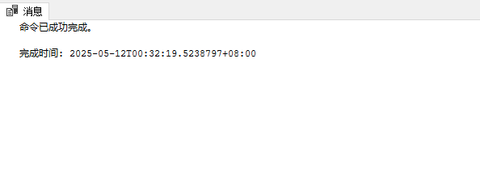
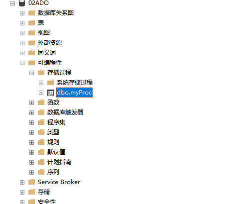
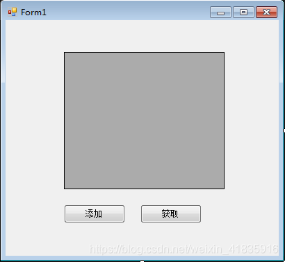
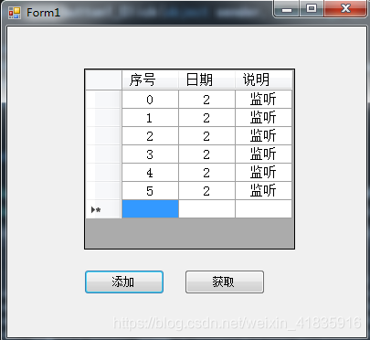
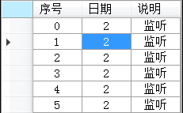
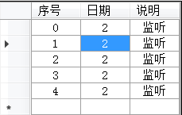

# ADO.NET笔记

视频链接：[C#之ADO.NET数据库操作技术](https://www.bilibili.com/video/BV1124y1K726/?share_source=copy_web&vd_source=1faf6f8be863497a8aa161f8493e14d2)(这个视频的水印：北盟网校 www.bamn.cn)

ADO.NET是.NET操作数据库的一个模块的总称，我们通过它来操作数据库，对数据库进行增删改查等等操作。还可以**执行sql语句**，**调用SQL里面的函数** **执行存储过程**等等。我们很多大型的业务系统都是离不开数据库，我们需要把一些数据固化到本地，并且想要方便查找的话，那么就需要使用数据库了。

ADO主要就是提供一些对象，这些对象封装了一些操作数据库的一些方法。比如Connection Command DataSet DataReader 它们每个都有自己的功能。**Connection**

是用来对数据进行连接 

**Command**

主要是执行SQL的命令等。

**DataSet**

它其实是一个数据的集合，它是对数据库进行一个抽象，我们操作这个DataSet就好像操作数据一样。DataSet里面就包含DataTable（表）DataRow对应表中的一条记录

**DatAdapter**

相当于数据库的一个适配器

学习这个ADO.NET我们才能开发一些更强大的业务系统，包括我们的网站都是离不开数据库的。

ORM框架，EF     ibatis      nhibenatie      linq to entity这些底层都是ADO.NET

## 02节-数据库连接Connections 

**Connections 用户和数据库进行连接 是数据库操作的桥梁**

.NET 提供了 SqlConnection 这个类给我们，命名空间是 System.Data.SqlClient 类集是 System.Data.dll。我们和数据库有关的东西都基本在这个 dll 里面封装的

在连接之前我们首先需要准备数据库的连接字符串，因为我们在创建对象的时候需要用到

```csharp
SqlConnection conn = new SqlConnection (connectionString)
```

### **连接字符串**

其实就是一个字符串来的，用 string 来保存。下面应该是以SQL Sever 数据库为主进行讲解的。

#### 两种登录方式

**1、sa 登陆：(账号密码登录)**

```csharp
"Data Source=.;Initial Catalog=dbtest;User ID=sa;pwd=123456;"
```

**2、windows 登陆（这个可能只有SQL SEVER有）**

```csharp
Data Source=.;Initial Catalog = 数据库;Integrated Security=True
```

#### 连接字符串组成

1. 字符串中由多部分组成，各部分用英文分号隔开
2. 每一个值用 = 来隔开 
3. Data Source 表示数据库地址，如果是本地 通常可以用 (local) 127.0.0.1 或者[.]英文句号来表示，如果是远程服务器则可能可以用域名或者IP地址。
4. Initial Catalog 后面跟着的是数据库名
5. User ID 后面跟着的是数据库账号
6. pwd 后面是数据库密码
7. 当然 User ID 和 pwd 不是必须的。如果是使用 windows 登录 则可以用 Integrated Security=True 集成安全模式
8. 连接字符串可以在Visual Studio 添加数据库连接中配置

   

#### Tips

1. **连接字符串的顺序是没有要求，SQLServer是这样子的，其他数据库不是特别清楚。**
2. 连接字符串参考网址：[[连接字符串 - ADO.NET Provider for SQL Server | Microsoft Learn](https://learn.microsoft.com/zh-cn/sql/connect/ado-net/connection-strings?view=sql-server-ver16)](https://learn.microsoft.com/zh-cn/dotnet/api/system.data.sqlclient.sqlconnection.connectionstring?view=net-8.0-pp)
3. System.Data.SqlClient 包现已弃用,建议使用 Microsoft.Data.SqlClient 

#### 远程数据库连接

[配置SQLServer，远程连接 （超详细）_sqlserver配置远程连接-CSDN博客](https://blog.csdn.net/yanghezheng/article/details/114298590)

正确写法：

```csharp
 //builder.DataSource = ".";
 //builder.DataSource = "tcp:1116-SL,1433";//这个字符串可以连上
 //builder.DataSource = "tcp:(local)";//这个也可以，之前不行可能是未配置防火墙的原因
 //builder.DataSource = "np:(local)";//OK
 //builder.DataSource = @"1116-SL";//OK
 //builder.DataSource = "1116-SL,1433";//OK
 //builder.DataSource = "tcp:1116-SL";//OK
 //builder.DataSource = @"tcp:127.0.0.1,1433";//OK
 //builder.DataSource = "127.0.0.1,1433\\MSSQLSERVER";//OK,那还是相当于我被主机名给误导了
 //主机名要么是IP地址，要么是主机名
```

##### 实例名是什么？

在 SQL Server 里，实例名称是用来标识在同一台物理服务器上运行的不同 SQL Server 安装的标识符。一台物理服务器能够同时运行多个 SQL Server 实例，每个实例都拥有独立的配置、数据库和服务。以下为你详细介绍：

###### 实例名称的用途

- **区分不同安装**：借助实例名称，可在同一台服务器上区分不同的 SQL Server 安装。比如，一台服务器上可能同时运行着用于生产环境和开发环境的 SQL Server 实例，它们分别使用不同的实例名称。
- **独立配置**：每个实例都有自己独立的配置，像内存分配、安全设置、网络协议等。通过实例名称，你可以针对不同的实例进行个性化的配置。
- **数据库管理**：每个实例可以有自己的一组数据库。你可以依据不同的业务需求，在不同的实例中创建和管理数据库。

###### 实例名称的格式和示例

- **默认实例**：如果在安装 SQL Server 时选择了默认实例，那么实例名称通常是省略的，或者简单地用服务器名称来表示。例如，服务器名为 `SERVER01`，默认实例就可以通过 `SERVER01` 来访问。
- **命名实例**：若安装时选择了命名实例，就需要为实例指定一个名称。实例名称会跟随在服务器名称后面，用反斜杠 `\` 分隔。例如，服务器名为 `SERVER01`，实例名称为 `SQLDEV`，那么完整的实例标识符就是 `SERVER01\SQLDEV`。

###### 如何查看实例名称

1. 第一种通过服务配置中心查看
   1. 按下 `Win + R` 组合键，打开 “运行” 对话框，输入 `SQLServerManager<版本号>.msc`（例如 SQL Server 2019 对应的是 `SQLServerManager15.msc` ），回车后打开 SQL Server 配置管理器。
   2. 在左侧面板中展开 “SQL Server 服务”。
   3. 你会看到正在运行的 SQL Server 实例，服务名称格式通常为 `SQL Server (<实例名>)`，括号内的就是实例名。若服务名称为 `SQL Server (MSSQLSERVER)`，则表明是默认实例。、
2. 第二种通过SSMS查看
   1. 打开 SSMS，在 “连接到服务器” 对话框中，“服务器名称” 下拉框里会显示已发现的 SQL Server 实例，若已连接到某个实例，在对象资源管理器的顶部也能看到当前连接的服务器名称（包含实例名）。

### 主键自增配置


### 使用SSMS操作数据库，不可以修改表，报错原因

1. 工具，选项


### SqlCommand

#### 常用方法

| 项                                                           | 说明                                                         |
| :----------------------------------------------------------- | :----------------------------------------------------------- |
| [BeginExecuteNonQuery](https://learn.microsoft.com/zh-cn/dotnet/api/microsoft.data.sqlclient.sqlcommand.beginexecutenonquery?view=sqlclient-dotnet-standard-5.2) | 启动此 [SqlCommand](https://learn.microsoft.com/zh-cn/dotnet/api/microsoft.data.sqlclient.sqlcommand?view=sqlclient-dotnet-standard-5.2)描述的 Transact-SQL 语句或存储过程的异步执行，通常执行 INSERT、DELETE、UPDATE 和 SET 语句等命令。 对 的每个调用 [BeginExecuteNonQuery](https://learn.microsoft.com/zh-cn/dotnet/api/microsoft.data.sqlclient.sqlcommand.beginexecutenonquery?view=sqlclient-dotnet-standard-5.2) 都必须与完成操作的调用配对，该调用 [EndExecuteNonQuery](https://learn.microsoft.com/zh-cn/dotnet/api/microsoft.data.sqlclient.sqlcommand.endexecutenonquery?view=sqlclient-dotnet-standard-5.2) 通常在单独的线程上完成操作。 |
| [BeginExecuteReader](https://learn.microsoft.com/zh-cn/dotnet/api/microsoft.data.sqlclient.sqlcommand.beginexecutereader?view=sqlclient-dotnet-standard-5.2) | 启动由此 [SqlCommand](https://learn.microsoft.com/zh-cn/dotnet/api/microsoft.data.sqlclient.sqlcommand?view=sqlclient-dotnet-standard-5.2) 描述的 Transact-SQL 语句或存储过程的异步执行，并从服务器检索一个或多个结果集。 对 的每个调用 [BeginExecuteReader](https://learn.microsoft.com/zh-cn/dotnet/api/microsoft.data.sqlclient.sqlcommand.beginexecutereader?view=sqlclient-dotnet-standard-5.2) 都必须与完成操作的调用配对，该调用 [EndExecuteReader](https://learn.microsoft.com/zh-cn/dotnet/api/microsoft.data.sqlclient.sqlcommand.endexecutereader?view=sqlclient-dotnet-standard-5.2) 通常在单独的线程上完成操作。 |
| [BeginExecuteXmlReader](https://learn.microsoft.com/zh-cn/dotnet/api/microsoft.data.sqlclient.sqlcommand.beginexecutexmlreader?view=sqlclient-dotnet-standard-5.2) | 启动此 [SqlCommand](https://learn.microsoft.com/zh-cn/dotnet/api/microsoft.data.sqlclient.sqlcommand?view=sqlclient-dotnet-standard-5.2) 描述的 Transact-SQL 语句或存储过程的异步执行。 对 的每个调用 `BeginExecuteXmlReader` 都必须与对 `EndExecuteXmlReader`的调用配对，该调用通常会在单独的线程上完成操作，并返回 一个 [XmlReader](https://learn.microsoft.com/zh-cn/dotnet/api/system.xml.xmlreader) 对象。 |
| [ExecuteReader](https://learn.microsoft.com/zh-cn/dotnet/api/microsoft.data.sqlclient.sqlcommand.executereader?view=sqlclient-dotnet-standard-5.2) | 执行返回行的命令。 为了提高性能， [ExecuteReader](https://learn.microsoft.com/zh-cn/dotnet/api/microsoft.data.sqlclient.sqlcommand.executereader?view=sqlclient-dotnet-standard-5.2) 使用 Transact-SQL `sp_executesql` 系统存储过程调用命令。 因此， [ExecuteReader](https://learn.microsoft.com/zh-cn/dotnet/api/microsoft.data.sqlclient.sqlcommand.executereader?view=sqlclient-dotnet-standard-5.2) 如果用于执行 Transact-SQL SET 语句等命令，则可能不会产生所需的效果。 |
| [ExecuteNonQuery](https://learn.microsoft.com/zh-cn/dotnet/api/microsoft.data.sqlclient.sqlcommand.executenonquery?view=sqlclient-dotnet-standard-5.2) | 执行 Transact-SQL INSERT、DELETE、UPDATE 和 SET 语句等命令。 |
| [ExecuteScalar](https://learn.microsoft.com/zh-cn/dotnet/api/microsoft.data.sqlclient.sqlcommand.executescalar?view=sqlclient-dotnet-standard-5.2) | 检索单个值 (例如，从数据库) 聚合值。求和，计数等。           |
| [ExecuteXmlReader](https://learn.microsoft.com/zh-cn/dotnet/api/microsoft.data.sqlclient.sqlcommand.executexmlreader?view=sqlclient-dotnet-standard-5.2) | 将 [CommandText](https://learn.microsoft.com/zh-cn/dotnet/api/microsoft.data.sqlclient.sqlcommand.commandtext?view=sqlclient-dotnet-standard-5.2) 发送到 [Connection](https://learn.microsoft.com/zh-cn/dotnet/api/microsoft.data.sqlclient.sqlcommand.connection?view=sqlclient-dotnet-standard-5.2)，并生成一个 [XmlReader](https://learn.microsoft.com/zh-cn/dotnet/api/system.xml.xmlreader) 对象。 |

参考链接：[SqlCommand 类 (Microsoft.Data.SqlClient) | Microsoft Learn](https://learn.microsoft.com/zh-cn/dotnet/api/microsoft.data.sqlclient.sqlcommand?view=sqlclient-dotnet-standard-5.2&devlangs=csharp&f1url=%3FappId%3DDev17IDEF1%26l%3DZH-CN%26k%3Dk(Microsoft.Data.SqlClient.SqlCommand)%3Bk(SolutionItemsProject)%3Bk(SolutionItemsProject)%3Bk(DevLang-csharp)%26rd%3Dtrue)

#### ExecuteNonQuery

int rows = command.ExecuteNonQuery();//返回受影响的行数。适合非查询的操作。

### 设置超时时间(SqlCommand)

```csharp
command.CommandTimeout = 10;//默认是30秒
```

### 判断连接是否已开启（SqlConnection）

```csharp
if(conn.State!=ConnectionState.Open) conn.Open(); 
```

### 设置命令参数（SqlCommand）

有时候我们的Sql语句中需要传入参数，并不是固定写死的。

**写死的命令**

```csharp
command.CommandText = "select 1";
```

## 10节-执行多条SQL语句，实现数据库事务。

利用 SqlCommand 里面的 Transaction 可以实现事务回滚效果，事务就是将一系列操作作为一个单元执行，要么成功，要么失败，回滚到最初状态。在事务处理术语中，事务要么提交，要么中止。若要提交事务，所有参与者都必须保证对数据的任何更改是永久的。不论系统崩溃或是发生其他无法预料的事件，更改都必须是持久的。只要有一个参与者无法做出此保证，整个事务就会失败。事务范围内的所有数据更改将回滚到特定设置点

```c#
SqlTransaction tx = conn.BeginTransaction ();
cmd.Transaction = tx;
//遍历多条 sql 语句
int count = 0; //记录
cmd.CommandText = strsql;
count += cmd.ExecuteNonQuery ();
tx.Commit ();//没出现问题则调用
tx.Rollback ();//报异常了
```

## 11节-SqlDataReader的使用，读取多条数据

SqlDataReader 对象提供只读单向数据的快速传递

1. 单向：您只能依次读取下一条数据；
2. 只读：SqlDataReader 中的数据是只读的，无法修改；

```csharp
SqlConnection connection = new SqlConnection (connectionString);
SqlCommand cmd = new SqlCommand (strSQL, connection);
connection.Open ();
SqlDataReader myReader = cmd.ExecuteReader (CommandBehavior.CloseConnection);
// 判断数据是否读到尾.
while (reader.Read ())
{
Console.WriteLine (String.Format ("{0}, {1}",
reader [0], reader [1]));
}
// 一定要关闭 reader 对象.
reader.Close ();
```

## 12节-SqlDataAdapter和DataSet 的使用，返回数据表

DataSet 类似我们的数据表集，它里面是可以有多张表的，我们这一次就不需要 SqlCommand 了，而是使用 sqlDataadapter。
```c#
SqlConnection connection = new SqlConnection (connectionString)
DataSet ds = new DataSet ();
connection.Open ();
SqlDataAdapter command = new SqlDataAdapter (SQLString, connection);
command.Fill (ds, "ds");
//将 SqlDataAdapter 里面的内容填充到 DataSet 中
//也可以设置时间
command.SelectCommand.CommandTimeout
```

## 13节-执行存储过程，返回SqlDataReader

和前面差不多，执行存储过程需要指定一下 SqlCommand 的 CommandType
```csharp
SqlCommand command = new SqlCommand (storedProcName, connection);
command.CommandType = CommandType.StoredProcedure;
//如果带参数 可以指定参数
SqlParameter parameter
command.Parameters.Add (parameter);
SqlDataReader reader = command.ExecuteReader (CommandBehavior.CloseConnection);
```

创建一个存储过程，在数据库中操作。

```sql
create proc myProc
	@id int
as
	select * FROM [02ADO].[dbo].[Aticle] where id > @id
go
```

创建存储过程

```sql
create procedure myNewProc(@id int)
as
begin
	declare @count int
	update Aticle set title='111' where id = @id
	select @count =COUNT(1) from Aticle where id > @id
	return @count
end
```


完成截图



存储过程位置，在对应数据库下面。创建完之后，刷新需要选择对应的数据库。不需要重启对应的数据库服务。




数据库中执行存储过程

```sql
exec [dbo].[myProc] @id =1
```

csharp代码

```csharp
private void bt_存储过程_Click(object sender, EventArgs e)
{
    using (SqlConnection conn = new SqlConnection(ConnectStr.ConnectionString))
    {
        if (conn.State != ConnectionState.Open) conn.Open();
        using (SqlCommand command = new SqlCommand())
        {
            command.CommandText = "myProc";//myProc是存储过程的名字
            command.Connection = conn;
            command.CommandType = CommandType.StoredProcedure;//存储过程需要配置这个
            SqlParameter param = new SqlParameter("@id", SqlDbType.Int, 8);
            param.Direction = ParameterDirection.Input;
            param.Value = 4;
            command.Parameters.Add(param);

            var res = command.ExecuteReader(CommandBehavior.CloseConnection);
            while (res.Read())
            {
                MessageBox.Show(string.Format("{0},{1},{2}", res[0], res[1], res[2]));
            }
            res.Close();
        }
    }
}
```

## 14 节 - 执行存储过程，返回 DataSet

和前面 13 节一样，不过我们需要返回 dataset，所以使用 SqlDataAdapter
```csharp
SqlConnection connection = new SqlConnection (connectionString)
DataSet dataSet = new DataSet ();
connection.Open ();
SqlDataAdapter sqlDA = new SqlDataAdapter ();
SqlCommand command = new SqlCommand (storedProcName, connection);
command.CommandType = CommandType.StoredProcedure;
SqlParameter parameter
command.Parameters.Add (parameter);
sqlDA.SelectCommand = command;
sqlDA.Fill (dataSet, tableName);
//其中 tableName 表示 DataSet 结果中的表名
```

## 15 节 - 执行存储过程，返回受影响的行数

```csharp
SqlConnection connection = new SqlConnection (connectionString)
connection.Open ();
SqlCommand command = new SqlCommand (storedProcName, connection);
command.CommandType = CommandType.StoredProcedure;
command.Parameters.Add (parameter);// 这里添加一些参数
command.Parameters.Add (new SqlParameter ("ReturnValue",
SqlDbType.Int, 4, ParameterDirection.ReturnValue,
false, 0, 0, string.Empty, DataRowVersion.Default, null));
//ReturnValue 参数表示诸如存储过程、内置函数或用户定义函数之类的操作的返回值。
int rowsAffected = command.ExecuteNonQuery (); //这个可以返回受影响的记录数
int result = (int) command.Parameters ["ReturnValue"].Value; //这个可以得到函数或者存储过程里面的值
```

执行存储过程的sql

```sql
USE [02ADO]
GO

DECLARE	@return_value int

EXEC	@return_value = [dbo].[myNewProc]
		@id = 1

SELECT	'Return Value' = @return_value

GO

```


定义函数sql，函数中好像不支持update这类影响数据库的操作，未求证。

```sql
create function myFun(@id int)
returns  int
as
begin
	declare @count int
	
	select @count =COUNT(1) from Aticle where id > @id
	return @count
end
```


# SQL Server 数据库

## 修改数据库连接密码


重启服务，正常连接，需要信任服务器证书


参考链接1：[SqlServer密码修改超级详细_sqlserver修改密码-CSDN博客](https://blog.csdn.net/qq_33435148/article/details/120680216)

参考链接2：[只需3步，修改SQLServer的sa密码-CSDN博客](https://blog.csdn.net/TheToysOfTown/article/details/121910417)

### 这样创捷出来的账户遇到了权限问题

账号：xiaoliu操作什么数据库都操作不了


数据库权限参考链接：[SQL Server 权限管理 - pursuer.chen - 博客园](https://www.cnblogs.com/chenmh/p/4080420.html)

数据库权限参考链接：[一学就会的Sql Server数据库权限管理_sql 表属性权限-CSDN博客](https://blog.csdn.net/Friendsofthewind/article/details/111941382)

#### 设置服务器权限

第一个像是预设


下面这个像是对单个权限进行设置


#### **新建数据库用户**


登录名只能选择现有的


## 数据迁移

使用 **Microsoft.EntityFrameworkCore.Tools **迁移数据到Sql Server

1. 在程序包管理器中使用Add-Migration 创建迁移

2. 注意设置启动项目

   

3. 注意观察报错信息

   ```cmd
   PM> add-migration InitCreate
   Build started...
   Build succeeded.
   File 'E:\Code\VsStudio\Jingan567\LcDataBaseCoverAll\DataBaseTest\bin\Debug\net8.0-windows\SQLServer_EFCore.dll' not found.
   PM> add-migration InitCreate
   Build started...
   Build succeeded.
   Unable to create a 'DbContext' of type 'CustomerDbContext'. The exception 'Keyword not supported: 'ConnectTimeout'.' was thrown while attempting to create an instance. For the different patterns supported at design time, see https://go.microsoft.com/fwlink/?linkid=851728
   PM> #上面的问题是连接字符串配置的有问题，或者数据库连接需要SSL证书等
   ```


## EF Core操作SqlServer数据库

### 设置主键、外键的方式

1. Fluent Api

   ```csharp
   modelBuilder.Entity<Order>()
           .HasOne(o => o.Customer)    // Order 关联到 Customer（一对一导航）
           .WithMany(c => c.Orders)    // Customer 关联到多个 Order（一对多导航）
           .HasForeignKey(o => o.CustomerId) // 指定外键属性
           .OnDelete(DeleteBehavior.Restrict); // 设置级联行为（如禁用级联删除）
   
   //多对多
   modelBuilder.Entity<Student>()
       .HasMany(s => s.Teachers)
       .WithMany(t => t.Students)
       .UsingEntity<StudentTeacher>(j => j.ToTable("StudentTeachers"));
   
   //设置主键
   //1.在DbContext中设置
   protected override void OnModelCreating(ModelBuilder modelBuilder)
   {
       modelBuilder.Entity<Car>()
           .HasKey(c => c.LicensePlate);  // 指定单个属性为主键
     
     	//指定约束名称
     modelBuilder.Entity<Blog>()
       .HasKey(b => b.BlogId)
       .HasName("PrimaryKey_BlogId");  // 自定义主键约束名[1](@ref)
   }
   
   //2.也可以写在EntityTypeConfig中
    public void Configure(EntityTypeBuilder<Teacher> builder)
    {
      //两种方式
        builder.ToTable("T_Teachers").HasKey(s => s.TeacherId);
      
        builder.HasKey(s => s.TeacherId);
    }
   //3.复合主键
   protected override void OnModelCreating(ModelBuilder modelBuilder)
   {
     modelBuilder.Entity<Car>()
       .HasKey(c => new { c.State, c.LicensePlate });  // 联合主键配置[1,3,5](@ref)
   }
   ```

2. 数据注解

   1. **复合主键**：EF Core 不支持通过数据注解直接定义复合主键，必须使用 Fluent API

   ```csharp
   public class Order
   {
     	[Key]//设置主键
       public int Id { get; set; }
       [ForeignKey("Customer")] // 指定关联到导航属性 Customer 的主键
       public int ClientId { get; set; } // 自定义外键属性名
       public Customer Customer { get; set; }
   }
   ```

3. 默认约定

   ```csharp
   //设置主键
   public int BlogId { get; set; }  // 自动识别为主键并自增
   ```


### 注意事项

1. 使用EF Core操作数据库，如果手动进数据库修改（比如主键），EF Core 的迁移脚本不能识别出来，后续迁移就会有问题。会导致版本错误，使用EF Core就不要去手动操作数据库


## 报错信息

**Unable to create a 'DbContext' of type 'CustomerDbContext'. The exception 'Keyword not supported: 'ConnectTimeout'.' was thrown while attempting to create an instance. For the different patterns supported at design time, see https://go.microsoft.com/fwlink/?linkid=851728**

这个报错最常见的出现，是因为数据模型有问题。

参考链接：[c# - 在干净架构中创建上下文工厂时出现问题 - Stack Overflow](https://stackoverflow.com/questions/79354379/trouble-when-creating-a-context-factory-in-clean-architecture)


**A connection was successfully established with the server, but then an error occurred during the login process. (provider: SSL Provider, error: 0 - 证书链是由不受信任的颁发机构颁发的。)**

修改连接字符串就可以了。

参考链接：[c# - Error : A connection was successfully established with the server, but then an error occurred during the login process - Stack Overflow](https://stackoverflow.com/questions/76944191/error-a-connection-was-successfully-established-with-the-server-but-then-an-e)


**修改主键列报错 ：To change the IDENTITY property of a column, the column needs to be dropped and recreated.**

参考链接：[c# - 更改列的 IDENTITY 属性，需要删除并重新创建该列 - Stack Overflow](https://stackoverflow.com/questions/53408175/change-the-identity-property-of-a-column-the-column-needs-to-be-dropped-and-rec)

1. 注释原有的主键列，新主键不能使用
2. 在已有主键的情况下，不会将默认以id结尾的属性转成主键
3. 主键更改，引用这个主键的外键用也会更新
4. 主键只能设置一个，好像也可以设置两个的。有点懵逼。


# DataGridView的使用

## 参考链接

链接1：[C# DataGridView（干货版） - 一杯清酒邀明月 - 博客园](https://www.cnblogs.com/ybqjymy/p/12487214.html)

## C#DataGridView(干货版)

### 一、添加行列并获取信息

界面如下：



代码如下：

```csharp
using System;
using System.Collections.Generic;
using System.ComponentModel;
using System.Data;
using System.Drawing;
using System.Linq;
using System.Text;
using System.Threading.Tasks;
using System.Windows.Forms;

namespace DataGridView
{
  public partial class Form1 : Form
  {
    int count = 0;
    public Form1()
    {
      InitializeComponent();
    }

    private void Form1_Load(object sender, EventArgs e)
    {
      //根据Header和所有单元格的内容自动调整行的高度
      dataGridView1.AutoSizeRowsMode = DataGridViewAutoSizeRowsMode.AllCells;  
      //添加三列
      for (int i = 0; i < 3; i++)
      {
        dataGridView1.Columns.Add(new DataGridViewTextBoxColumn());
        dataGridView1.Columns[i].AutoSizeMode = DataGridViewAutoSizeColumnMode.AllCells;  //设置所有列自适应宽度
      }
      //三列的标题
      dataGridView1.Columns[0].HeaderText = "序号";
      dataGridView1.Columns[1].HeaderText = "日期";
      dataGridView1.Columns[2].HeaderText = "说明";
      //设置对齐方式和字体
      dataGridView1.RowsDefaultCellStyle.Alignment = DataGridViewContentAlignment.MiddleCenter;
      dataGridView1.Font = new Font("宋体", 11);
    }
    //添加行
    private void button1_Click(object sender, EventArgs e)
    {
      int index = this.dataGridView1.Rows.Add();
      this.dataGridView1.Rows[index].Cells[0].Value = count++;
      this.dataGridView1.Rows[index].Cells[1].Value = "2";
      this.dataGridView1.Rows[index].Cells[2].Value = "监听";
    }
    //获取信息
    private void button2_Click(object sender, EventArgs e)
    {
      //获取当前活动单元格内容
      Console.WriteLine("当前活动单元格内容：" + dataGridView1.CurrentCell.Value);  
      //取得当前单元格的列Index
      Console.WriteLine("当前单元格的列Index：" + dataGridView1.CurrentCell.ColumnIndex); 
      //取得当前单元格的行Index
      Console.WriteLine("取得当前单元格的行Index：" + dataGridView1.CurrentCell.RowIndex);   
      // 设定 (1, 1) 为当前单元格 
      dataGridView1.CurrentCell = dataGridView1[1, 1];   
    }
  }
}
```

测试：

点击添加：



选中（2,1）处的单元格，点击获取，命令行输出：

```
 当前活动单元格内容：2
 当前单元格的列Index：1
 取得当前单元格的行Index：2
```

活动单元格变为（1,1）处的单元格：



------

### 二、设置单元格只读属性

代码如下：

```csharp
using System;
using System.Collections.Generic;
using System.ComponentModel;
using System.Data;
using System.Drawing;
using System.Linq;
using System.Text;
using System.Threading.Tasks;
using System.Windows.Forms;

namespace DataGridView
{
  public partial class Form1 : Form
  {
    int count = 0;
    public Form1()
    {
      InitializeComponent();
    }

    private void Form1_Load(object sender, EventArgs e)
    {
      //根据Header和所有单元格的内容自动调整行的高度
      dataGridView1.AutoSizeRowsMode = DataGridViewAutoSizeRowsMode.AllCells;  
      //添加三列
      for (int i = 0; i < 3; i++)
      {
        dataGridView1.Columns.Add(new DataGridViewTextBoxColumn());
        dataGridView1.Columns[i].AutoSizeMode = DataGridViewAutoSizeColumnMode.AllCells;  //设置所有列自适应宽度
      }
      //三列的标题
      dataGridView1.Columns[0].HeaderText = "序号";
      dataGridView1.Columns[1].HeaderText = "日期";
      dataGridView1.Columns[2].HeaderText = "说明";
      //设置对齐方式和字体
      dataGridView1.RowsDefaultCellStyle.Alignment = DataGridViewContentAlignment.MiddleCenter;
      dataGridView1.Font = new Font("宋体", 11);

      /******************************新增加的代码************************************/
      dataGridView1.ReadOnly = true;    //设置所有单元格都不可编辑
      // 设置 DataGridView1 的第2列整列单元格为只读
      dataGridView1.Columns[1].ReadOnly = true;   
      // 设置 DataGridView1 的第3行整行单元格为只读
      dataGridView1.Rows[2].ReadOnly = true;     
      // 设置 DataGridView1 的[0，0]单元格为只读
      dataGridView1[0, 0].ReadOnly = true;        
      /**********************************************************************************/
    } 
    //添加行
    private void button1_Click(object sender, EventArgs e)
    {
      int index = this.dataGridView1.Rows.Add();
      this.dataGridView1.Rows[index].Cells[0].Value = count++;
      this.dataGridView1.Rows[index].Cells[1].Value = "2";
      this.dataGridView1.Rows[index].Cells[2].Value = "监听";
    }
    //获取
    private void button2_Click(object sender, EventArgs e)
    {
      //获取当前活动单元格内容
      Console.WriteLine("当前活动单元格内容：" + dataGridView1.CurrentCell.Value); 
      //取得当前单元格的列Index
      Console.WriteLine("当前单元格的列Index：" + dataGridView1.CurrentCell.ColumnIndex); 
      //取得当前单元格的行Index
      Console.WriteLine("取得当前单元格的行Index：" + dataGridView1.CurrentCell.RowIndex);   
      // 设定 (1, 1) 为当前单元格 
      dataGridView1.CurrentCell = dataGridView1[1, 1];   
    }
  }
}
```

[](javascript:void(0);)

测试：

双击单元格，单元格不可编辑：



------

### 三、最新一行不显示

通常 DataGridView 的最下面一行是用户新追加的行（行头显示 * ）


即不想显示该新行，可以将 DataGridView 对象的 AllowUserToAddRows 属性设置为 False。

代码如下：

[](javascript:void(0);)

```csharp
using System;
using System.Collections.Generic;
using System.ComponentModel;
using System.Data;
using System.Drawing;
using System.Linq;
using System.Text;
using System.Threading.Tasks;
using System.Windows.Forms;

namespace DataGridView
{
  public partial class Form1 : Form
  {
    int count = 0;
    public Form1()
    {
      InitializeComponent();
    }

    private void Form1_Load(object sender, EventArgs e)
    {
      //根据Header和所有单元格的内容自动调整行的高度
      dataGridView1.AutoSizeRowsMode = DataGridViewAutoSizeRowsMode.AllCells; 
      //添加三列
      for (int i = 0; i < 3; i++)
      {
        dataGridView1.Columns.Add(new DataGridViewTextBoxColumn());
        //设置所有列自适应宽度
        dataGridView1.Columns[i].AutoSizeMode = DataGridViewAutoSizeColumnMode.AllCells;  
      }
      //三列的标题
      dataGridView1.Columns[0].HeaderText = "序号";
      dataGridView1.Columns[1].HeaderText = "日期";
      dataGridView1.Columns[2].HeaderText = "说明";
      //设置对齐方式和字体
      dataGridView1.RowsDefaultCellStyle.Alignment = DataGridViewContentAlignment.MiddleCenter;
      dataGridView1.Font = new Font("宋体", 11);

      //设置所有单元格都不可编辑
      dataGridView1.ReadOnly = true;    
      // 设置 DataGridView1 的第2列整列单元格为只读
      dataGridView1.Columns[1].ReadOnly = true; 
      // 设置 DataGridView1 的第3行整行单元格为只读  
      dataGridView1.Rows[2].ReadOnly = true;      
      // 设置 DataGridView1 的[0，0]单元格为只读 
      dataGridView1[0, 0].ReadOnly = true;               
    }
    //添加行
    private void button1_Click(object sender, EventArgs e)
    {
      int index = this.dataGridView1.Rows.Add();
      this.dataGridView1.Rows[index].Cells[0].Value = count++;
      this.dataGridView1.Rows[index].Cells[1].Value = "2";
      this.dataGridView1.Rows[index].Cells[2].Value = "监听";
      /*****************新增加的代码********************/
      dataGridView1.AllowUserToAddRows = false;
      /*************************************************/
    }
    //获取
    private void button2_Click(object sender, EventArgs e)
    {
      //获取当前活动单元格内容
      Console.WriteLine("当前活动单元格内容：" + dataGridView1.CurrentCell.Value);  
      //取得当前单元格的列Index
      Console.WriteLine("当前单元格的列Index：" + dataGridView1.CurrentCell.ColumnIndex);  
      //取得当前单元格的行Index
      Console.WriteLine("取得当前单元格的行Index：" + dataGridView1.CurrentCell.RowIndex);  
      // 设定 (1, 1) 为当前单元格 
      dataGridView1.CurrentCell = dataGridView1[1, 1];   
    }
  }
}
```

测试：


------

### 四、行列的隐藏和删除

（1） 行、列的隐藏

```csharp
1 DataGridView1.Columns[0].Visible = false;    // DataGridView1的第一列隐藏 
2 DataGridView1.Rows[0].Visible = false;       // DataGridView1的第一行隐藏 
```

  (2） 行头、列头的隐藏

```csharp
1 DataGridView1.ColumnHeadersVisible = false; // 列头隐藏 
2 DataGridView1.RowHeadersVisible = false; // 行头隐藏 
```

（3） 行和列的删除

```csharp
 //删除名为"Column1"的列 
 DataGridView1.Columns.Remove("Column1");
 //删除第一列
 DataGridView1.Columns.RemoveAt(0);
 //删除第一行 
 DataGridView1.Rows.RemoveAt(0);
```

（4） 删除选中行

```csharp
 foreach (DataGridViewRow r in DataGridView1.SelectedRows)
 {
     if (!r.IsNewRow)
     {
         DataGridView1.Rows.Remove(r);
     }
 }    
```

### 五、禁止列或者行的Resize

（1） 禁止所有的列或者行的Resize

```csharp
1 // 禁止用户改变DataGridView1的所有列的列宽 
2 DataGridView1.AllowUserToResizeColumns = false;
3 //禁止用户改变DataGridView1の所有行的行高 
4 DataGridView1.AllowUserToResizeRows = false;
```

但是可以通过 DataGridViewColumn.Width 或者 DataGridViewRow.Height 属性设定列宽和行高。

（2） 禁止指定行或者列的Resize

```csharp
 // 禁止用户改变DataGridView1的第一列的列宽 
 DataGridView1.Columns[0].Resizable = DataGridViewTriState.False;
 // 禁止用户改变DataGridView1的第一列的行宽 
 DataGridView1.Rows[0].Resizable = DataGridViewTriState.False;
```

（3） 列宽和行高的最小值的设定

```csharp
 // 第一列的最小列宽设定为 100
 DataGridView1.Columns[0].MinimumWidth = 100;
 // 第一行的最小行高设定为 50
 DataGridView1.Rows[0].MinimumHeight = 50;
```

（4） 禁止用户改变行头的宽度以及列头的高度

```csharp
 // 禁止用户改变列头的高度 
 DataGridView1.ColumnHeadersHeightSizeMode = DataGridViewColumnHeadersHeightSizeMode.DisableResizing;
 // 设置用户改变行头的宽度 
 DataGridView1.RowHeadersWidthSizeMode = DataGridViewRowHeadersWidthSizeMode.EnableResizing;
```

### 六、列宽和行高自动调整的设定

（1） 设定所有单元格行高和列宽自动调整

```csharp
 // 设定包括Header和所有单元格的列宽自动调整 
 DataGridView1.AutoSizeColumnsMode = DataGridViewAutoSizeColumnsMode.AllCells;
 // 设定包括Header和所有单元格的行高自动调整 
 DataGridView1.AutoSizeRowsMode = DataGridViewAutoSizeRowsMode.AllCells;
```

（2） 设定指定单元格行高和列宽自动调整

```csharp
 // 第一列自动调整 
 DataGridView1.Columns[0].AutoSizeMode = DataGridViewAutoSizeColumnMode.DisplayedCells;
 // 设定列头的宽度可以自由调整 
 DataGridView1.ColumnHeadersHeightSizeMode = DataGridViewColumnHeadersHeightSizeMode.AutoSize;
 // 设定行头的宽度可以自由调整 
 DataGridView1.RowHeadersWidthSizeMode = DataGridViewRowHeadersWidthSizeMode.AutoSizeToAllHeaders;
```

### 七、行头列头的单元格

```csharp
// 改变DataGridView1的第一列列头内容
DataGridView1.Columns[0].HeaderCell.Value = "第一列";
// 改变DataGridView1的第一行行头内容
DataGridView1.Rows[0].HeaderCell.Value = "第一行";
// 改变DataGridView1的左上头部单元内容
DataGridView1.TopLeftHeaderCell.Value = "左上";
```

### 八、单元格的边框、网格线样式的设定

（1）DataGridView 的边框线样式的设定

DataGridView 的边框线的样式是通过 DataGridView.BorderStyle 属性来设定的。

BorderStyle 属性设定值是一个BorderStyle 枚举： FixedSingle（单线，默认）、Fixed3D、None。

（2）单元格的边框线样式的设定

单元格的边框线的样式是通过 DataGridView.CellBorderStyle 属性来设定的。

CellBorderStyle 属性设定值是DataGridViewCellBorderStyle 枚举。

（4） 单元格的边框颜色的设定 单元格的边框线的颜色可以通过 DataGridView.GridColor 属性来设定的。

默认是 ControlDarkDark 。但是只有在 CellBorderStyle 被设定为 Single、SingleHorizontal、SingleVertical 的条件下才能改变其边框线的颜色。

同样，ColumnHeadersBorderStyle 以及 RowHeadersBorderStyle 只有在被设定为 Single 时，才能改变颜色

### 九、实现示例

#### 隔行不同色单元格

- 使用默认属性设置

  ```csharp
  dataGridView1.AlternatingRowsDefaultCellStyle.BackColor = Color.Yellow;//获取或设置应用于 DataGridView 的奇数行的默认单元格样式。这里设置背景色，好像没有按照上下去更新，要么奇数行优先级更高
  dataGridView1.RowsDefaultCellStyle.BackColor = Color.LightSkyBlue;//获取或设置 DataGridView 单元格的背景色
  ```

- 使用判断实现

  参考链接：【C#.Winform基础教程-动态设置DataGridview奇数偶数行不同的背景颜色】 https://www.bilibili.com/video/BV1tGRGYRELz/?share_source=copy_web&vd_source=1faf6f8be863497a8aa161f8493e14d2

  ```csharp
   //设置每一行的数据
   //遍历表格中的每一行
   foreach (DataGridViewRow row in dataGridView1.Rows)//DataGridViewRow不是DataRow
   {
       //需要获取当当前遍历的所在行
       int index = row.Index;
       //判断这个索引的奇偶性
       if (index % 2 == 1)
       {
           //正常来算，对2取余数等于1，是奇数
           //索引从0开始，行和列都是从0开始
           //所以这是偶数行
           row.DefaultCellStyle.BackColor = Color.Azure;
       }
       else
       {
           //计数行
           row.DefaultCellStyle.BackColor = Color.LightSkyBlue;
       }
   }
  ```

  

