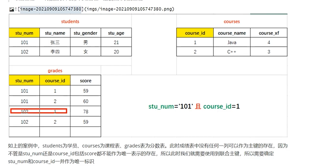
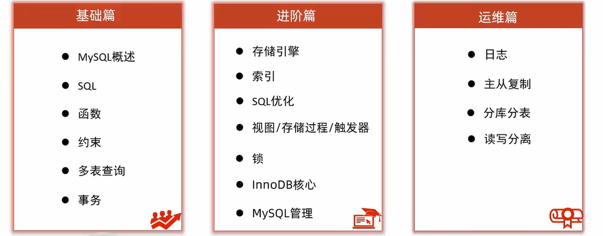
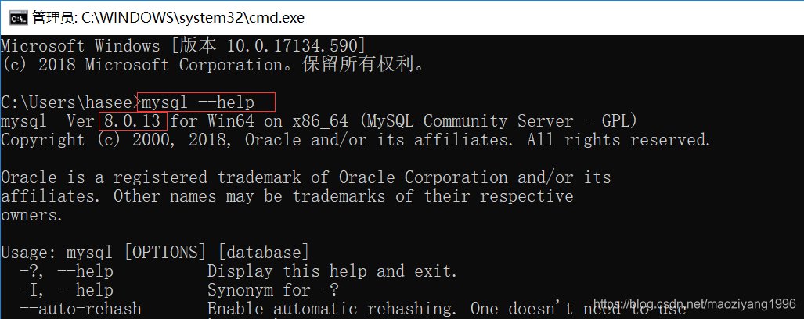

# [VS2019 快速实现 C# 连接 MySQL 数据库并实现基本操作代码](https://www.cnblogs.com/RioTian/p/15581594.html)

## 一、工具：

1. Visual Studio 2019
2. MySQL 数据库

## **二、添加动态链接：**

Visual Studio 中选择项目-> 管理NuGet程序包(N) -> 然后在浏览里面搜索 `MySql.Data` 并进行安装。

> 注意：因为 .Net 框架 和 MySQL 版本问题安装时可能要选用不同的版本


## **三、测试连接：**

1. 创建一个类来放数据库的连接和各种操作，我这里创建的是 `Dao.cs`
2. 加入需要的头文件

```C#
using System;
using System.Collections.Generic;
using System.Linq;
using System.Text;
using System.Threading.Tasks;
using MySql.Data.MySqlClient; // 这个是必须的
```

1. 连接数据库，并返回一个 `MySqlConnection` 对象；并实现基本操作；

```C#
namespace BookMS
{
    class Dao
    {
        MySqlConnection conn;
        // String sql = $"SELECT * FROM t_admin WHERE id = '{textBox1.Text}' and pwd = '{textBox2.Text}'";
      public MySqlConnection getConn()
        {
            string connstr = "server=127.0.0.1;port=3306;user=root;password=****;database=bookdb;Charset=utf8;";
          	// 其中server是数据库所在网络的IP地址，127.0.0.1代表本地，port是数据库设置的端口号，user用户名，password密码，database是要连接的数据库名，Charset=utf8主要是处理中文编码问题
            conn = new MySqlConnection(connstr);
            conn.Open(); // 打开数据库
            return conn; // 返回数据库对象
        }
        public MySqlCommand command(string sql)
        {
            MySqlCommand cmd = new MySqlCommand(sql, getConn());
            return cmd;
        }
        public int Execute(string sql) // 更新操作
        {
            return command(sql).ExecuteNonQuery();
        }
        public MySqlDataReader read(string sql) // 读取操作
        {
            return command(sql).ExecuteReader();
        }

        public void DaoClose() // 关闭数据库连接
        {
            conn.Close(); 
        }
    }
}
```

1. 查询操作

```C#
MySqlConnection conn = getConn(); //连接数据库
conn.Open(); //打开数据库连接
string sql = "select * from user'" ;
MySqlCommand cmd = new MySqlCommand(sql, conn);
MySqlDataReader mdr = cmd.ExecuteReader();
if (mdr.Read()) {
    string str = mdr["authority"].ToString();//接收一个返回值
    //对查询到数据进行相应的操作
}
conn.Close();
```

1. 增删改操作类似，只是 `sql` 语句不相同，这里以插入操作为例

```C#
MySqlConnection conn = getConn(); //连接数据库
conn.Open(); //打开数据库连接
string sql = "insert into user values('123','123')";
MySqlCommand cmd = new MySqlCommand(sql, conn);
cmd.ExecuteNonQuery();
conn.Close();
```

> 说明：在进行对数据库具体操作时建议在 `Dao` 类中直接写不同的函数来实现，在Form代码处创建 `Dao` 对象来引用对应的方法，这样可以使代码更加简洁，同时也方便维护

# [Visual Studio 2019连接MySQL数据库详细教程](https://www.cnblogs.com/RioTian/p/15541568.html)

## 前言

**如果要在 Visual Studio 2019中使用MySQL数据库，首先需要下载MySQL的驱动**

**Visual Studio默认只显示微软自己的SQL Server数据源，点击其它也是微软自己的SQL Server数据源**

> 方法更新：[Here](https://www.cnblogs.com/RioTian/p/15581594.html)
> Windows 安装 MySQL 8.x 教程：[Here](https://cloud.tencent.com/developer/article/1636375)

## 开始食用

### 1、下载驱动

注意安装顺序！对于安装过程的类型选择，一般选择第一个 `Typical` 即可。

- [mysql-connector-odbc-8.0.27-winx64.msi](https://dev.mysql.com/downloads/connector/odbc/)

  `mysql odbc驱动`

- [mysql-for-visualstudio-1.2.10.msi](https://dev.mysql.com/downloads/windows/visualstudio/)

  `Visual Studio连接MySQL工具`

- [mysql-connector-net-8.0.27.msi](https://dev.mysql.com/downloads/connector/net/8.0.html)

  `mysql数据库.net开发驱动`

#### 驱动介绍

1. **`MySQL Connector/ODBC` 有时也可以叫做 `MyODBC`，用户可以用`ODBC (Open Database Connectivity`，开放数据库互联)数据库连接Mysql的服务器。比如说，用户可以使用Windows或者Unix平台中的应用程序，如微软的 `Access`，`Excel`和`Borland` 的`Delphi`去连接数据库服务器。**
2. **`mysql for visual studio`(VS连接MySQL工具)是一款`visual studio`连`mysql`工具，它可以直接集成到Server Explorer中，为设置新连接和处理数据库对象提供无缝体验，但是想让VS访问到MySQL仅仅mysql for visual studio是不够的，还需要下载`mysql connector net`。**
3. **`MySQL Connector/Net` 是 MySQL 官方的 `.NET` 驱动程序，`MySQL` 官方的 `.NET` 客户端开发包。`mysql` 数据库最新版`dotnet`数据库连接驱动。**

**根据自己的需求下载**

我们要用Visual Studio连接mysql只需要下载`mysql for visual studio`和`MySQL Connector/Net`

**遇到报错**


原因：我感觉还是因为少这个程序，并且程序版本可以也有冲突。没有找到安装这个软件的门路

解决方案：尝试所有的都从mysql的安装软件安装，先不安装ODBC。只安装其他两个。

Mysql 社区版下载地址：[MySQL下载 MySQL 安装程序](https://dev.mysql.com/downloads/installer/)

### 2、重启系统和VS2019

`菜单栏` -> `视图` -> **`服务器资源管理器`** -> **`数据连接`**

配置这个数据连接也只是方便VS访问数据库，和程序访问数据库没有联系


此时**你就会发现有MySQL 的选项了，进入里面配置数据库相关信息即可**

### 3、配置信息详解

`Server name`输入`MySQL`的IP地址：

localhost即本地，localhost=127.0.0.1

一般我们直接选择本地输入`localhost`或者`127.0.0.1`

然后输入MySQL的用户名和密码

Database name输入`test`（`可自行选择`）

test：`这个是安装时候创建的一个测试数据库，和它的名字一样，是一个完全的空数据库，没有任何表，可以删除。`


**这里再添加一个说明，若你的数据库设置的端口为‘3306’（默认），若你的数据库端口更改了，比如改成了‘3307’，需要点击高级，把里面的【port】改为对应的’3307‘即可。**


建立连接后**属性界面会显示详细信息**


**服务器资源管理器会显示数据库信息**，便于快速查看数据库中表的信息


------


QAQ


------

**连接MySQL的教程也就结束了**

**但是光Visual Studio连接MySQL还不行，还需要添加MySQL的引用**

**安装`MySQL Connector/Net`就是用来添加`MySQL`的引用，教程在另一篇文件**

详细见另一篇教程：[Here](https://www.cnblogs.com/RioTian/p/15541731.html#sql命令的执行方法)

# [C# | VS2019连接MySQL的三种方法以及使用MySQL数据库教程](https://www.cnblogs.com/RioTian/p/15541731.html)

**`本文将介绍3种添加MySQL引用的方法，以及连接MySQL和使用MySQL的教程`**

前篇：Visual Studio 2019连接MySQL数据库详细教程

------


QAQ


------

## 下面这三种方法只是通过不同的方式获取Mysql.Data.dll这个类库

### **第一种方法**

1. 下载 `Mysql.data.dll`，下载链接：[Here](https://cn.dll-files.com/mysql.data.dll.html) （`可自选版本下载`）

2. 将文件解压至合适的地方

3. 在VS2019项目内，引用 `Mysql.data.dll` 文件

   **在项目中右键引用->添加引用->浏览->选中`MySql.Data.dll`文件->确定**


完成添加后就可以看到已经添加`Mysql.data`引用（`引用属性里可以看到引用详细信息`）


### **第二种方法**

1. 添加动态链接库文件：官网下载 [connector/net](https://dev.mysql.com/downloads/connector/net/)

   如果已经看过[前篇博客](https://www.cnblogs.com/RioTian/p/15541568.html#) [前篇博客文档内链接](#Visual Studio 2019连接MySQL数据库详细教程)的话此步已经完成了。目前是按照这个方法去实操的

2. 将文件放在项目目录下

3. 在VS2019项目内，引用 `Mysql.data.dll` 文件

   注意，这里的 `Mysql.data.dll` 文件在我们刚刚安装的 `connector/net` 的内部文件夹下。

   如果不记得安装在哪里，可使用 Everything 快速定位`Mysql.data.dll`的文件路径

### **第三种方法**

直接在 `Visual Studio` 内添加 `mysql` 方案包

`菜单栏` -> `工具` -> `NuGet包管理器(N)` -> `管理解决方案的NuGet程序包(N)` -> 点击确定（`添加成功后会弹窗提示`）


**完成以上操作后即可通过代码连接数据库了**

------


QAQ


------

## C#使用MySQL

> [C语言中文网 - Mysql命令大全](http://c.biancheng.net/cpp/u/mysql_ml/)
>
> MySQL  官网链接：[MySQL  MySQL Connector/NET 开发人员指南](https://dev.mysql.com/doc/connector-net/en/)

**主要使用类**

- [MySqlConnection](https://dev.mysql.com/doc/dev/connector-net/latest/api/data_api/MySql.Data.MySqlClient.MySqlConnection.html)：表示与 MySQL 数据库的打开连接。
- [MySqlConnectionStringBuilder](https://dev.mysql.com/doc/dev/connector-net/latest/api/data_api/MySql.Data.MySqlClient.MySqlConnectionStringBuilder.html)：通过将连接选项公开为属性来帮助创建连接字符串。
- [MySqlCommand](https://dev.mysql.com/doc/dev/connector-net/latest/api/data_api/MySql.Data.MySqlClient.MySqlCommand.html)：表示要对 MySQL 数据库执行的 SQL 语句。
- [MySqlCommandBuilder](https://dev.mysql.com/doc/dev/connector-net/latest/api/data_api/MySql.Data.MySqlClient.MySqlCommandBuilder.html)：自动生成单表命令，用于协调对 DataSet 对象与关联的 MySQL 数据库所做的更改。
- [MySqlDataAdapter](https://dev.mysql.com/doc/dev/connector-net/latest/api/data_api/MySql.Data.MySqlClient.MySqlDataAdapter.html)：表示一组数据命令和一个数据库连接，用于填充数据集和更新 MySQL 数据库。
- [MySqlDataReader](https://dev.mysql.com/doc/dev/connector-net/latest/api/data_api/MySql.Data.MySqlClient.MySqlDataReader.html)：提供一种从 MySQL 数据库读取只进行流的方法。
- [MySqlException](https://dev.mysql.com/doc/dev/connector-net/latest/api/data_api/MySql.Data.MySqlClient.MySqlException.html)：MySQL 返回错误时引发的异常。
- [MySqlHelper](https://dev.mysql.com/doc/dev/connector-net/latest/api/data_api/MySql.Data.MySqlClient.MySqlHelper.html)：Helper 类，可以更轻松地使用提供程序。
- [MySqlTransaction](https://dev.mysql.com/doc/dev/connector-net/latest/api/data_api/MySql.Data.MySqlClient.MySqlTransaction.html)：表示要在 MySQL 数据库中进行的 SQL 事务。
- [MySQLMembershipProvider](https://dev.mysql.com/doc/dev/connector-net/latest/api/web_api/MySql.Web.Security.MySQLMembershipProvider.html)：管理 MySQL 数据库中 ASP.NET 应用程序的成员资格信息的存储。
- [MySQLRoleProvider](https://dev.mysql.com/doc/dev/connector-net/latest/api/web_api/MySql.Web.Security.MySQLRoleProvider.html)：管理 MySQL 数据库中 ASP.NET 应用程序的角色成员身份信息的存储。
- [MySqlEFConfiguration](https://dev.mysql.com/doc/dev/connector-net/latest/api/ef_api/MySql.Data.EntityFramework.MySqlEFConfiguration.html)：添加 MySQL 类的依赖项解析程序。
- [MySqlExecutionStrategy](https://dev.mysql.com/doc/dev/connector-net/latest/api/ef_api/MySql.Data.EntityFramework.MySqlExecutionStrategy.html)：启用从暂时性连接故障中自动恢复。


**使用`using`来调用`mysql`连接，这样使用完后可以自动关闭连接
连接数据库，不用手动写关闭数据库的方法。**

**导入命名空间`using MySql.Data.MySqlClient;`**


**部分参数介绍：**

- `data source`=服务器IP地址;
- `database`=数据库名称;
- `user id`=数据库用户名;
- `password`=数据库密码;
- `pooling`=是否放入连接池;
- `charset`=编码方式;

**连接数据库的参数：**

```c#
string connectstring= "data source=localhost;database=test1;user id=root;password=root;pooling=true;charset=utf8;";
```

**连接数据库的方法：**

```C#
MySqlConnection msc = new MySqlConnection(connectstring);
```

### 补充一下`SqlConnectionStringBuilder`

在写连接字符串的时候要写很长一段，容易写错
`SqlConnectionStringBuilder` 可以用来帮助我们生成连接字符串.

这样就可以分开来写`DataSource`，`InitialCatalog`，`UserID` ，`Password` 等…

```C#
//与数据库连接的信息
MySqlConnectionStringBuilder builder = new MySqlConnectionStringBuilder();
//用户名
builder.UserID = "root";
//密码
builder.Password = "root";
//服务器地址
builder.Server = "localhost";
//连接时的数据库
builder.Database = "lcz";
//定义与数据连接的链接
MySqlConnection connection = new MySqlConnection(builder.ConnectionString);
//打开这个链接
connection.Open();
```

### 一般写连接字符串

```C#
//导入命名空间
using MySql.Data.MySqlClient;

static void Main(string[] args)
{
    //定义mysql连接字符串
    string constring = "data source=localhost;database=test1;user id=root;password=root;pooling=true;charset=utf8;";
    //连接mysql
    MySqlConnection msc = new MySqlConnection(constring);
}
```

### MySQL连接字符串参数详细解析

**通常数据库连接字符串为：**

```C#
Database=dbname;Data Source=192.168.1.1;Port=3306;User Id=root;Password=****;Charset=utf8;TreatTinyAsBoolean=false;
```

|                             参数                             |                           说明                           |
| :----------------------------------------------------------: | :------------------------------------------------------: |
| Server，host, data source, datasource, address, addr, network address |              数据库位置(以上任何关键字均可)              |
|                  Database，initial catalog                   |                         数据库名                         |
|                             Port                             |                 socket 端口，默认 `3306`                 |
|                 ConnectionProtocol，protocol                 |                 连接协议，默认　Sockets                  |
|                        PipeName，pipe                        |                   连接管道，默认 MYSQL                   |
|                   UseCompression，compress                   |                 连接是否压缩，默认 false                 |
|                          AllowBatch                          |          是否允许一次执行多条SQL语句，默认 true          |
|                           Logging                            |                 是否启用日志，默认 false                 |
|                       SharedMemoryName                       |                内存共享的名称，默认 MYSQL                |
|             UseOldSyntax，old syntax, oldsyntax              |              是否兼容旧版的语法，默认 false              |
|            ConnectionTimeout，connection timeout             |                连接超时等待时间，默认15s                 |
|            DefaultCommandTimeout，command timeout            |             MySqlCommand 超时时间，默认 30s              |
|            UserID, uid, username, user name, user            |                      数据库登录帐号                      |
|                        Password，pwd                         |                         登录密码                         |
|                     PersistSecurityInfo                      |               是否保持敏感信息，默认 false               |
|                           Encrypt                            |                         Encrypt                          |
|                       CertificateFile                        |                    证书文件(.pfx)格式                    |
|                     CertificatePassword                      |                        证书的密码                        |
|                   CertificateStoreLocation                   |                      证书的存储位置                      |
|                    CertificateThumbprint                     |                         证书指纹                         |
|                      AllowZeroDateTime                       |               日期时间能否为零，默认 false               |
|                     ConvertZeroDateTime                      |  为零的日期时间是否转化为 DateTime.MinValue，默认 false  |
|                UseUsageAdvisor, usage advisor                |        是否启用助手，会影响数据库性能，默认 false        |
|     ProcedureCacheSize，procedure cache, procedurecache      |       同一时间能缓存几条存储过程，0为禁止，默认 25       |
|         UsePerformanceMonitor，userperfmon, perfmon          |               是否启用性能监视，默认 false               |
|                        IgnorePrepare                         |            是否忽略 Prepare() 调用，默认 true            |
|             UseProcedureBodies,procedure bodies              |       是否检查存储过程体、参数的有效性，默认 true        |
|                          AutoEnlist                          |            是否自动使用活动的连接，默认 true             |
|                      RespectBinaryFlags                      |        是否响应列上元数据的二进制标志，默认 true         |
|                      TreatTinyAsBoolean                      |        是否将 TINYINT(1) 列视为布尔型，默认 true         |
|                      AllowUserVariables                      |         是否允许 SQL 中出现用户变量，默认 false          |
|               InteractiveSession，interactive                |               会话是否允许交互，默认 false               |
|                    FunctionsReturnString                     |      所有服务器函数是否按返回字符串处理，默认 false      |
|                       UseAffectedRows                        | 是否用受影响的行数替代查找到的行数来返回数据，默认 false |
|                           OldGuids                           |        是否将 binary(16) 列作为 Guids，默认 false        |
|                          Keepalive                           |           保持 TCP 连接的秒数，默认0，不保持。           |
|                      ConnectionLifeTime                      |     连接被销毁前在连接池中保持的最少时间(秒)。默认 0     |
|                           Pooling                            |                是否使用线程池，默认 true                 |
|                MinimumPoolSize, min pool size                |             线程池中允许的最少线程数，默认 0             |
|                MaximumPoolSize，max pool size                |            线程池中允许的最多线程数，默认 100            |
|                       ConnectionReset                        |            连接过期后是否自动复位，默认 false            |
|                    CharacterSet, charset                     |         向服务器请求连接所使用的字符集，默认：无         |
|                       TreatBlobsAsUTF8                       |        binary blobs 是否按 utf8 对待，默认 false         |
|                   BlobAsUTF8IncludePattern                   |      列的匹配模式，一旦匹配将按 utf8 处理，默认：无      |
|                           SslMode                            |      是否启用 SSL 连接模式，默认：MySqlSslMode.None      |

### SQL命令的执行方法

`ExcuteNonQuery执行增改删`：

1. `insert`（增）
2. `updata`（改）
3. `delete`（删）

`ExcuteReader`：执行多行查询，返回DataReader对象

`ExcuteScalar`：执行单行查询，返回查询结果的首行数据

创建`MySQL`命令对象： `MySqlCommand cmd = new MySqlCommand(sql, msc);`

读取`DataReader`对象单行数据： `reader.Read()`
获取单行字段数据： `reader.GetInt32(0); reader.GetString(1);`

```C#
//导入命名空间
using MySql.Data.MySqlClient;

static void Main(string[] args)
{
    //定义mysql连接字符串
    string constring = "data source=localhost;database=test1;user id=root;password=root;pooling=true;charset=utf8;";
    //连接mysql
    MySqlConnection msc = new MySqlConnection(constring);
    // region MySQL操作
    //写入sql语句
    string sql = "select * from user";
    //创建命令对象
    MySqlCommand cmd = new MySqlCommand(sql, msc);
    //打开数据库连接
    msc.Open();
    //执行命令,ExcuteReader返回的是DataReader对象
    MySqlDataReader reader = cmd.ExecuteReader();
    //循环单行读取数据，当读取为null时，就退出循环
    while (reader.Read())
    {
        //输出第一列字段值
        Console.Write(reader.GetInt32(0) + "\t");
        //Console.Write(reader.GetInt32("id") + "\t");

        //判断字段"username"是否为null，为null数据转换会失败
        if (!reader.IsDBNull(1))
        {
            //输出第二列字段值
            Console.Write(reader.GetString(1) + "\t");
            //Console.Write(reader.GetString("username") + "\t");
        }
        //判断字段"password"是否为null，为null数据转换会失败
        if (!reader.IsDBNull(2))
        {
            //输出第三列字段值
            Console.Write(reader.GetString(2) + "\n");
            //Console.Write(reader.GetString("password") + "\t");
        }
    }
}
     Console.ReadKey();
}
```


# Mysql

## Mysql事件相关

博客地址：https://blog.csdn.net/K346K346/article/details/133268598

```sql
show events;
SHOW PROCESSLIST;
SELECT * FROM information_schema.processlist;
SHOW GLOBAL VARIABLES LIKE 'event_scheduler';
```

今年的目标瘦到170斤！！一个项目并不是采用的技术越新越好，高级的技术，维护的成本也会提高，最重要的是稳定！

涉及到用户输入的东西，一定要写TryCatch，或者尝试将他转型需要的类型，转成功没问题失败返回

Mysql视频学习链接：[2023新版mysql从入门到精通视频教程(74集全)](https://www.bilibili.com/video/BV1PG411Q7nE/?p=2&share_source=copy_web&vd_source=b83eef0c8a1f48fdadaa97e04126b0b9)

## 数据库概念

数据库是“按照数据结构来组织、存储和管理数据的仓库”。是一个长期存储在计算机内的、有组织的、可共享的、统一的管理大量数据的集合。数据库软件还提供了高效的增加\删除\修改\查询数据的解决方案

数据库，就是存放数据的仓库

数据库(DataBase，简称DB)是长期存储在计算机内部有结构的、大量的、共享的数据集合。

- 长期存储：持久化
- 有结构：
  - 类型：数据库不仅可以存放数据，而且存放的数据是有类型的
  - 关系：存储数据与数据之间的关系
- 大量：大多数数据库都是文件系统的，也就是说存储在数据库中的数据实际上就是存储在磁盘的文件中
- 共享：多个应用程序可以通过数据库实现数据的共享

### **为什么需要用数据库**

其实通过io技术对数据进行简易的增删改查，实际上相当于自己写了一个数据库软件，但功能简单，执行效率低下，而且每个项目都开发数据操作相关代码致使开发效率低下，数据库就是当前计算机软件开发行业中，对大量数据管理的通用解决方案，学习数据库就是学习如何和数据库软件进行交流，SQL语言就是程序员和数据库软件沟通的语言。

### **关系型数据库与非关系型数据库**

数据库可以分为关系型和非关系型数据库：

- 关系型数据库
  - 关系型数据库，采用了关系模型来组织数据的存储，以行和列的形式存储数据并记录数据与数据之间的关系 ——将数据存储在表格中，可以通过建立表格与表格之间的关联来维护数据与数据之间的关系。
- 非关系型数据库
  - 非关系型数据库，采用键值对的模型来存储数据，只完成数据的记录，不会记录数据与数据之间的关系。NoSQL(Not only SQL)数据库来指代非关系型数据库。

### **常见的数据库产品**

关系型数据库产品

- **MySQL免费（最常用）**
  - MariaDB
  - Percona Server
- PostgreSQL
- **Oracle收费（常用）**
- SQL Sever
- Access
- Sybase
- 达梦数据库（国产）

非关系型数据库

- 面向检索的列式存储 Column-oriented
  - HaBase(Hadoop子系统)
  - BigTable(Google)
- 面向高并发的缓存存储Key-Value
  - **Redis**
  - MemcacheDB
- 面向海量数据访问的文档存储 Document-Oriented
  - **MongoDB**
  - CouchDB

### 数据库术语


- **数据库(Database)**：存储的数据的集合，提供数据存储的服务
- **数据(Data)**：实际上指的是描述事务的符号记录
- **数据库管理系统(DataBase Manager System. DBMS)**：数据库管理系统，是位于用户和操作系统之间的一层数据管理软件
- **数据库系统管理员(Database Anministrator. 简称为DBA)**：负责数据库创建、使用及维护的专门人员
- **数据库系统(DataBase System. DBS)**：数据库系统管理员、数据库管理系统及数据库组成整个单元

MySQL数据库环境准备

​	MySQL下载、安装、配置、卸载、安装DBMS、使用DBMS

### MySQL安装


一般选择按需自定义安装

## 后面只记重要的，节省时间


```重要笔记
create database if not exists Db_Test;
use Db_Test;
create table if not exists Student(
	stu_Num char(8) not null,
    stu_Name varchar(20) not null
);
SQL中不区分大小写
Alter database db_test character set gbk;/*修改字符集，database里面的table字符集不会随之一起修改*/
```

id字段的数据类型为INT(11)，注意后面的数字11，它表示的是该数据类型指定的显示宽度，即能够显示的数值中数字的个数


decimal(10,2)//总共10位，小数点后2位


图片和视频如果要存在数据库中得转换成2进制字符串然后存储在tinyblob、blob、mediumblob(常用)、longblob。不过一般存储的都是文件在服务器上的路径，用varchar存

tinytext、text、mediumtext、longtext存储文本数据。**一个汉字占2个字节，一个英文字符占用1个字节**

书中的图


### 约束

- 保证数据的有效性
- 保证数据的完整性
- 保证数据的正确性

### 常见约束

- 非空约束（Not null）:限制此列的值必须提供，不能为null
- 唯一约束（unique）: 在表中的多条数据，此列的值不能重复
- 主键约束（primary key）:能够唯一标识数据表中的一条数据，一般自增
- 外键约束（foreign key）:建立不同表之间的联系

唯一约束

```sql
use db_test;
create table books(
	book_isbn char(4) unique,
    book_name varchar(10) not null,
    book_author varchar(6)
);
insert books (book_isbn,book_name )values(1,2);
insert books (book_isbn,book_name )values(1,2);/*插入第二遍会报Error Code: 1062. Duplicate entry '1' for key 'book_isbn'	0.015 sec
*/
desc books;/*查看表的描述*/
```

主键约束

主键——就是数据表中记录的为一标识，在一张表中只能有一个主键（主键可以是一个列，**也可以是多个列的组合**），类似非空加唯一

联合主键——将数据 表中的多列组合在一起设置为表的主键



联合主键定义

```sql
use db_test;
#联合主键的定义
create table if not exists grades
(
	stu_nyum char(8),
    course_id int,
    score int,
    primary key(stu_nyum,course_id)
);
desc grades;
flush tables;

#下面这种定义了两个主键的，执行会报错
use db_test;
#联合主键的定义
create table if not exists grades
(
	stu_nyum char(8) primary key,
    course_id int primary key,
    score int
);
desc grades;
flush tables;

#修改表格主键
ALTER TABLE `db_test`.`grades` 
ADD PRIMARY KEY (`stu_nyum`, `course_id`);
```

一个表中不可以定义两个主键，但是可以定义联合主键，使用Mysql WorkBench，快速定义

注意：**在实际企业项目的数据库设计中，联合主键使用频率并不高；当一个数据表中没有明确的字段可以作为主键时，我们可以额外添加一个ID字段作为主键。**警惕：不要为了设计而设计

### DML

```sql
#插入
insert into 表名 （列名） values (值1)；#列名和值一一对应，可以打乱顺序，也不用给所有的列都赋值
insert into students(
  stu_num,
  stu_name,
  stu_gender
)values(
  '12212',
  '张三'，
   81
);
insert into 表 values ();#这个样子就得给所有都添加，并且要和列名一一对应
******************************************************************************************************
#删除
delete from 表名 where 条件；
#不加条件会给所有数据都删了
delete from students；
******************************************************************************************************
#更新\修改
update students set stu_name ='孙琪' where stu_num = '20230105';
update students set stu_gender ='男',stu_qq ='7777' where stu_num ='2023000';
update students set stu_name ='孙琪';\*不加条件会导致该列所有值都被修改*\
```

### DQL

查询基础语法

```sql
#select 关键字后指定要显示查询到的记录的哪些列
select [colnumName1,colnumName2,colnumName3...] from <tableName>[where conditions];
#查询所有列，则可以使用*替代字段名列表（在项目开发中不建议使用*）
select * from stus;
```

#### Where 子句

在删除、修改及查询的语句后都可以添加where子句（条件），用于筛选满足特定的添加的数据进行删除、修改和查询操作。

**条件运算符**

=, !=, <, >, <=, >=

**使用between进行区间查询**

```sql
select * from students where stu_age between 17 and 29;
```

**条件逻辑运算符**

```sql
#and 并且，筛选同时满足
select * from stus where stu_gender ='女' and stu_age < 21;#也可以用&&
#or 或者，筛选多个条件至少满足一个条件的记录
select * from stus where stu_gender ='女' or stu_age < 21;
#not 取反
select * from stus where stu_age not between 17 and 29;
```

##### like子句

在where子句的条件中，我们可以使用like关键字来实现模糊查询

**语法**

```sql
select * from tablename where columnName like 'reg';
```

- 在like关键字后的reg表达式中
  - %表示任意多个字符【%0% 包含0】
  - _表示任意1个字符【__0% 第二个字母为0】

```sql
#查询姓名中的包含o的
select * from stus where stu_name like %o%;
#查询姓名中的第二个字母为o的
select * from stus where stu_name like _o%;
#查询姓名中的开头为张的
select * from stus where stu_name like 张%;
```

查询过程中计算列

```sql
select stu_name, 2023-stu_age from students;
```

#### as 字段取别名

```sql
select stu_name as 姓名, 2023-stu_age as 出生年份 from students;
```

**distinct 消除重复行**

从查询结果中将重复的记录消除

```sql
select distinct stu_age from students;
```

排序 order by

将查询到的满足条件的记录按照指定的列的值升序/降序排列

**语法**

```sql
select * from tableName where conditions order by columnName asc|desc
```

- order by columnName 表示将查询结果按照指定的列排序
  - asc 按照指定的列升序(默认 如果是默认的可以省略关键字asc 关键字)
  - desc 按照指定的列降序

实例

```sql
#单字段排序
select * from stus where stu_age > 15 order by stu_gender desc;
SELECT * FROM db_test.student order by stu_Text asc;/*不一定需要where子句*/
#多字段排序：先满足第一个排序规则，第一个排序规则完成之后，在按照第二个排序规则执行
select * from student where stu_age >15 order by stu_Text asc,stu_age desc;
+---------+----------+----------+------------+------------+---------+
| stu_Num | stu_Name | stu_Text | studentcol | stu_gender | stu_age |
+---------+----------+----------+------------+------------+---------+
| 4       | 王五     | 女       | NULL       | 4          | 26      |
| 3       | 张三     | 女       | NULL       | 3          | 24      |
| 5       | 陆六     | 男       | NULL       | 5          | 25      |
| 1       | 2        | 男       | 2          | 1          | 23      |
| 2       | 李四     | 男       |            | 2          | 23      |
+---------+----------+----------+------------+------------+---------+
5 rows in set (0.00 sec)
/*先根据第一个排序，排好序之后再按第二个排序*/
```

#### 聚合函数

SQL中提供了一些可以对查询记录进行计算的函数——聚合函数

- count统计函数
- max 最大值
- min 最小值
- sum 求和
- avg 平均值

count() 统计函数，统计满足条件的指定字段的个数（记录数）

```sql
#统计学生表中学生总数
select count(stu_nums) from stus;
#统计学生表中性别为男的学生总数（记录数）
select count(stu_nums) from stus where stu_gender = '男';
```

max() 计算最大值，查询满足条件的记录中指定列的最大值

```sql
select max(stu_nums) from stus;
select max(stu_nums) from stus where coditions;
select min(stu_nums) from stus;
```

##### 日期函数和字符串函数

```sql
#日期函数
insert into stus values('','','',now());
insert into stus values('','','',sysdate());
#字符串函数
#通过sql指令对字符串进行处理
select cocat('stu_name','-','stu_gender') from students;/*拼接字符串*/
substring(字符串，开始位置（从1开始），长度)
upper()#大写
lower()#小写
```

#### 分组查询 group by

```sql
#格式 []里面是可有可无的，group by 一般和having一起使用
select 分组字段/聚合函数
from 表名
[where 条件]
group by 分组列名 [having 条件]
[order by 排序字段]

#只显示当前分组的第一条数据
select * from students group by stu_gender;
select stu_name from students group by stu_gender;
#查询所有学生，按年龄进行分组，然后分别统计人数，再按年龄升序显示
select stu_age,count(stu_num) from students group by stu_age order by stu_age;
#查询所有学生，按年龄进行分组，然后分别统计人数，再筛选人数>1的组，再按年龄升序显示
select stu_name,count(stu_num) from students group by stu_age having count(stu_num)>1 order by stu_age; 
```

#### 分页查询 limit

当数据表中的数据比较多的时候，如果一次性全部查询出来显示给用户，用户的可读性/体验性都不太好，因此我们可以将这些数据分页进行展示

**语法**

```sql
select...
from...
where...
limit param1,param2
```

- param1 int, 表示获取查询语句的结果中的第一条数据的索引（索引从0开始）
- param2 int, 表示获取的查询记录的条数（如果剩下的数据条数<param2,则返回剩下的所有记录）

案例

对数据表中的学生信息进行分页显示，总共有10条数据，我们每页显示3条

```sql
#案例，总共12条数据
select * from stus limit 0,3;#第一页
select * from stus limit 3,3;#第二页
select * from stus limit 6,3;#第三页
select * from stus limit 9,3;#第四页
总记录数 count 10
每页显示 pageSize 3
总页数：pageCount = count/pageSize == 0?count/pageSize:count/pageSize+1;

#这样子也可以
SELECT * FROM db_test.student order by stu_num desc limit 2;
```

注意：SQL语句书写和执行顺序

书写：select、from、where、group by、having、order by、limit

执行：join、from、where、group by、having、select、order by、limit

### 数据表的关联关系

#### 关联关系介绍

MySQL是一个关系型数据库，不仅可以存储数据，还可以维护数据与数据之间的关系——通过在数据表中添加字段建立外键约束，外键是另一个表的主键

数据与数据之间的关联关系分为4种：

- 一对一关联
- 一对多关联
- 多对一关联
- 多对多关联

**一对一关联**

```sql
人——身份证号，一个人只有一个身份证号，一个身份证号只对应一个人
学生——学籍，
用户——用户个人信息，
```

方案一：主键关联——两张数据表中主键相同的数据为相互对应的数据，几乎不用


方案二：唯一外键——在任意一张表中添加一个字段添加外键约束与另一张表主键关联，并且**将外键列添加唯一约束**，防止外键列重复


**一对多关联**

班级--学生（一对多）一个班级包含多个学生

学生--班级（多对一）多个学生可以属于一个班级

图书--分类	商品--商品类别

方案：在多的一段添加外键，与一的外键进行关联


**多对多关联**

学生--课程	一个学生可以选择多门课、一门课程也可以由多个学生选择	

会员--社团	一个会员可以参加多个社团，一个社团也可以招纳多个会员

方法：额外创建一张关系表来维护多对多关联--在关系表中定义两个外键，分别与两个数据表的主键进行关联


```sql
#创建表的时候设置外键
create tableclasses(
	...,
  constraint FK_STUDENTS_CLASSES foreign key(cid) references classes(class_id)
#constraint(关键字) FK_STUDENTS_CLASSES(约束名称) foreign key(cid)（外键约束*具体字段） references classes(class_id)（关联表具体字段）
);

CREATE TABLE `db_test1`.`students` (
  `stu_id` INT NOT NULL AUTO_INCREMENT,
  `stu_name` VARCHAR(45) NULL,
  `cid` INT NULL,
  PRIMARY KEY (`stu_id`),
  CONSTRAINT `LK_STU_C`
  FOREIGN KEY (`cid`)
  REFERENCES `db_test1`.`classes` (`class_id`)
  ON DELETE NO ACTION
  ON UPDATE NO ACTION
);

#约束有名字代表可以删除
ALTER TABLE `db_test1`.`students` DROP FOREIGN KEY `LK_STU_C`;
#表创建完之后，增加外键
ALTER TABLE `db_test1`.`students` ADD CONSTRAINT `LK_STU_C` FOREIGN KEY (`cid`) REFERENCES `db_test1`.`classes` (`class_id`) ON DELETE NO ACTION ON UPDATE NO ACTION;

#实例，插入数据
INSERT INTO `db_test1`.`students` (`stu_name`, `cid`) VALUES ('张三', '1');//cid必须是classid里面的值，否则会报错，还可以是空值
```

#### **外键约束--级联**

当学生表中存在学生信息关联班级表中的某条记录时，就不能对班级表中这条记录进行修改ID和删除操作,但是添加完级联（cascade）之后就可以实现。

```sql
UPDATE `db_test1`.`classes` SET `class_id` = '3' WHERE (`class_id` = '1');#修改外键依赖的主键会报错
DROP TABLE `db_test1`.`classes`;#删除外键表，会报错

#可以新增
INSERT INTO `db_test1`.`classes` (`class_name`) VALUES ('C++2025');
#新增一列没有被依赖的话也可以修改
UPDATE `db_test1`.`classes` SET `class_id` = '5' WHERE (`class_id` = '6');//将6改成5

#重新给students表添加外键约束，但是同时要设置级联的的修改和删除
alter table students add constraint FK_STUDENTS_CLASSES foreign key(cid) referenxes classes(class_id) on update cascade on delete cscade;#cascade 级联
update classes set class_id=3 where class_name='Java2203';

#实例
ALTER TABLE `db_test1`.`students`  ADD CONSTRAINT `LK_STU_C` FOREIGN KEY (`cid`) REFERENCES `db_test1`.`classes` (`class_id`) ON DELETE CASCADE ON UPDATE CASCADE;

#级联后删除掉classes表中的一条记录（被依赖的），students中外键是这记录的都被删除了

```

- 如果一定要去修改classes表中的ID，该如何实现？
  - 将引用这个ID的学生记录的cid修改为NULL
  - 再修改班级信息表中的ID
  - 最后将学生表中设置为null的记录重新修改为新的cid

这个位置可能会有风险点，如果原本表中就有cid为空的，可能会出现数据错误

在MySQL中，级联操作是通过外键约束来实现的，级联更新（CASCADE）和级联删除（CASCADE）是四种设置值。

```文本
NO ACTION: 在从表中有外键关联到父表的数据时，如果你尝试删除或更新父表中的记录，则会报错。
CASCADE: 在从表中有外键关联到父表的数据时，如果你尝试删除或更新父表中的记录，相关的从表中的记录也会被自动删除或更新。
SET NULL: 在从表中有外键关联到父表的数据时，如果你尝试删除或更新父表中的记录，相关的从表中的记录的外键列将被设置为NULL。
RESTRICT: 在从表中有外键关联到父表的数据时，如果你尝试删除或更新父表中的记录，操作将被限制，也就是说，这个操作将不会被执行。
```


### 连接查询

通过对DQL的学习，我们可以很轻松的从一张数据表中查询出需要的数据；在企业的应用开发中，我们经常需要从多张表中查询数据（例如：我们查询学生信息的时候需要同时查询学生的班级信息），可以通过连接查询从多张数据表提取数据；

- inner join 内连接
- left join 左连接
- right join 右连接

**数据准备**

创建新的数据库db_test2

```sql
create database db_test2;
use db_test2;
```

创建班级信息表和学生信息表

```sql
create table classes(
	class_id int primary key auto_increment,
  class_name varchar(40) not null unique,
  class_remark varchar(200)
);
create table students(
	stu_num char(8) primary key,
  stu_name varchar(20) not null,
  stu_gender char(2) not null,
  cid int,
  constraint FK_STUDENTS_CLASSES foreign key(cid) references classes(class_id) on UPDATE CASCADE ON DELETE CASCADE
);
```

**添加数据**

添加班级信息

```sql
insert into classes(class_name,class_remark) values ('长跑一班','...');
insert into classes(class_name,class_remark) values ('跳远一班','...');
insert into classes(class_name,class_remark) values ('唱歌班','...');
insert into classes(class_name,class_remark) values ('长跑二班','...');
insert into classes(class_name,class_remark) values ('舞蹈班','...');
```

添加学生信息

```sql
insert into students(_name,class_remark) values ('长跑一班','...');
```

#### **内连接**

**语法**

```sql
select ... from tableName1 inner join tableName2 on 匹配条件[where 条件]；
```

笛卡尔积

笛卡尔积（A集合&B集合）：使用A中的每个记录依次关联B中的每个记录，笛卡尔积的总数 =A总数*B总数

如果直接执行select ... from tableName 1 inner join tableName2：会获取两种数据表中的数据集合的笛卡尔积（依次使用tableName1的数据匹配tableName2中的每一条数据）

内连接条件

两张表时使用innerjoin连接查询之后生成的笛卡尔积中的很多数据是无意义的，我们如何去除无意义的数据？——添加两张表连接查询的条件

```sql
#使用where设置过滤条件，先生成笛卡尔积再从笛卡尔积中过滤数据(效率很低)
select * from students inner join classes where students.cid = classes.Class_id
#使用ON设置连接查询条件，先判断连接条件是否成立，如果成立两表数据进行组合生成一条结果记录
select * from students inner join classes on students.cid = classes.class_id
```

结果： 只获取两张表中匹配成立条件成立的数据，任何一张表在另一种表如果没有找到对应匹配则不会出现查询结果中（例如：小红小明没有对应的班级信息，Java2106和Python2206没有对应学生）

#### 左连接LEFT JOIN

需求：请查询出所有的学生信息，如果学生有对应的班级信息，则将对应的班级信息也查询出来

左连接：显示左表中的所有数据，如果在右表中存在与左表记录满足匹配条件的数据，则进行匹配；如果右表中不存在匹配数据，则显示为Null

```sql
#语法
select * from leftTable LEFT JOIN rightTable on 匹配条件[where 条件]；

--左连接:显示左表中的所有记录
select * from students LEFT JOIN classes ON students.cid = classes.class_id;
```

#### **右连接**

```sql
select * from students RIGHT JOIN classes ON students.cid = classes.class_id;
```

**数据表别名**

 ```sql
alter table students rename column stu_name to name;//重命名数据库中表的列名
alter table classes rename column Class_name to name;
#如果在连接查询的多张表中存在相同名称的字段，我们可以使用表名。字段名来进行区分
select students.name,classes.name from students INNER JOIN classes ON students.cid = classes.class_id;
--如果表名太长则不便于SQL语句的编写，我们可以使用数据表别名
select s.name,c.name from students s INNER JOIN classes c ON s.cid = c.class_id;
 ```


#### 子查询/嵌套查询

子查询：先进行一次查询，第一次查询的结果作为第二次查询的源/条件（第二次查询是基于第一次查询结果来进行的）

**子查询返回单个值-单行单列**

案例1 ：查询班级名称为'Java2204'班级中的学生信息（只知道班级名称，而不知道班级ID）

-传统方式：

```sql
--a.查询Java2204班的班级编号
select class_id from classes where class_name ='Java2204';
--b.查询此班级编号下的学生信息
select * from students where cid = 1；
```

-子查询：

```sql
--如果子查询返回的结果是一个值（单列单行），条件可以直接使用关系运算符（= != ...）
select * from students where cid = (select class_id from classes where class_name = 'Java2205');
```

**子查询返回多个值-多行多列**

案例2：查询所有Java班级中的学生信息

-传统的方式：

```sql
--a.查询所有Java班的班级编号
select class_id from classes where class_name LIKE 'Java%';
--b.查询这些班级编号中的学生信息（union将多个查询语句的结果整合到一起）
select * from students where cid = 1 
UNION
select * from students where cid = 2
UNION
select * from students where cid = 3;
```

-子查询：in 代表包含，not in 代表不包含

```sql
#多行单列
select * from students where cid in (select class_id from classes where class_name LIKE 'Java%';);
#多行多列，将查询结果作为虚拟表
#查询cid = 1 的班级中性别为男的学生信息
select * from students where cid = 1；
select * from（select * from students where cid = 1） t where t.stu_gender = '男';
```

### **存储过程**

SQL指令的执行过程


问题：

1. 如果我们需要重复多次执行相同的SQL、SQL指令都需要通过连接传递到Mysql,并且需要编译和执行步骤；
2. 如果我们需要连续执行多个SQL指令，并且第二个SQL指令需要使用第一个SQL指令查询的结果作为参数；

**存储过程的介绍**


存储过程:

将能够完成特定功能的SQL指令进行封装（SQL指令集），编译之后存储在数据库服务器上，并为之取个名字，客户端可以直接通过名字调用这个SQL指令集，获取执行结果。类似代码中封装好的方法，直接调用就可以

存储过程的优缺点分析：

**存储过程优点:**

1. SQL指令无需客户端编写，通过网络传送，可以节省网络开销，同时避免SQL指令在网络传输过程中被恶意篡改保证安全
2. 存储过程经过编译创建并保存在数据库中的，执行过程无需重复的进行编译操作，对SQL指令的执行过程进行了性能提升
3. 存储过程中多个SQL指令之间存在逻辑关系，支持流程控制语句（分支、循环），可以实现更为复杂的业务；

**存储过程的缺点**

1. 存储过程根据不同的数据库进行编译、创建并保存在数据库中，当我们需要切换到其他的数据库产品时，需要重新编写新数据库的存储过程；
2. 存储过程受限于数据库产品，如果需要高性能的优化会成为一个问题；
3. 在互联网项目中，如果需要数据库的高（连接）并发访问，使用存储过程会增加数据库的连接执行时间（因为我们将复杂的任务交给了数据库进行处理）

**创建存储过程**

存储过程创建语法

```sql
--语法：
create procedure <proc_name>([IN/OUT args])
begin 
--SQL
end;
```

示例：

```sql
--创建一个存储过程实现加法运算：编程语言里，方法是有参数和返回值的，存储过程中，是有输入参数和输出参数的
create procedure proc_test1(IN a INT ,IN b int,out c int)
begin 
--set
	SET c = a+b;
end;
```

调用存储过程

```sql
--调用存储过程
--定义变量@m
set @m = 0;
--调用存储过程，将3传递给a,将2传递给b
call proc_test1(3,2,@m);
#显示变量值(dual系统表，定义的变量的值都会存储在其中)
select @m from dual;
```

#### **存储过程中变量的使用**

存储过程中的变量分为两种，局部变量和用户变量

**定义局部变量**

局部变量：定义存储过程中的变量，只能在存储过程内部使用

- 局部变量定义语法

  ```sql
  #局部变量要定义在存储过程中，而且必须定义在存储过程开始
  declare <attr_name> <type> [default value];
  ```

- 局部变量定义示例

  ```sql
  create procedure proc_test2（IN a int,OUT r int）
  begin
  	declare x int default 0;#定义x,int类型，默认值为0
  	declare y int default 1;#定义y
  	set x =a * a;
  	set y = a/2;
  	set r = x+y;
  end;
  ```

**用户变量**

用户变量：相当于全局变量，定义的用户变量可以通过select  @attrName from dual  进行查询

```sql
#用户变量是通过set 进行定义，同时要以@来进行开头定义变量名称
#用户变量存储在MYSQL数据库的数据字典中（dual）
set @n=1；
```

给变量设置值

- 无论是局部变量还是用户变量，都是使用set关键字修改值

```sql
set @n=1;
call proc_test2(6,@n);
select @n from dual;
```

将查询结果赋值给变量

在存储过程中使用select ... into ...给变量赋值

```sql
--查询学生数量
--注意在存储过程中使用SQL语句需要将结果赋值给变量，那么就需要使用into关键字来进行赋值
create procedure pro_test3(out c int)
begin
	select count(stu_num) into c from students;
end;
```

**用户变量使用注意事项**

因为用户变量相当于全局变量，可以在SQL指令及多个存储过程中共享，在开发中建议尽量少使用用户变量，用户变量过多会导致程序不易理解、难以维护。

#### 存储过程的参数

MySQL存储过程的参数一共有三种：IN\OUT\INOUT

IN**输入参数**

输入参数--在调用存储过程中传递数据给存储过程的参数（在调用过程中必须为具有实际值的变量或者字面值）

```sql
--创建存储过程，添加学生信息
create procedure pro_test4(IN snum char(8),IN sname varchar(20),IN gender char(2),IN age int,IN cid int, IN remark varchar(255))
begin
end;
#如果重名（参数不一样也算重名），删除或者改一个新的名字
DROP PROCEDURE `库名.`pro_test1`;
```

INOUT输入输出参数

将输入和输出参数整合成一个,尽量少用，容易混淆

```sql
create procedure proc_test5(INOUT str varchar(20))
begin
	select stu_name into str from students where stu_num = str;
end;

set @name1= '20202';
call proc_test5(@name1);
select @name from dual;
```

#### 存储过程中流程控制

在存储过程中支持流程控制语句用于实现逻辑的控制

**分支语句**

- if-then-else

```sql
-单分支，如果条件成立，则执行SQL
if conditions then
--
create procedure proc_test7(in a int)
begin
	if a=1 then
		insert into classes(class_name,class_remark)
			values('JAVA2208','test');
	 end if;
end;
CALL proc_test7(3);

#双分支 
create procedure proc_test7(in a int)
begin
	if a=1 then
		insert into classes(class_name,class_remark)
			values('JAVA2208','test');
	else
		insert into classes(class_name,class_remark)
			values('JAVA2208','test');
	end if;
end;
CALL proc_test7(3);
```

- case

```sql
Create procedure roc_test8(IN a int)
begin
	case a
		when 1 then
			Insert into classes(class_name,remark)values('Java2210','wahaha');
		when 2 then
			Insert into classes(class_name,remark)values('Java2210','wahaha');
		else
			update ....;
		end case;
end;
```

**循环语句**

- while

concat()函数用于将两个函数连接起来，形成一个单一的字符串

```sql
--while
create procedure proc_test9(IN num int)
begin
	declare i int
	set i = 0;
	while i<num do
			--sql
			set i = i+1;
	end while;
end;
```

- repeat

```sql
#repeat
create procedure proc_test9(IN num int)
begin
	declare i int
	set i = 1;
	repeat
			--sql
			set i = i+1;
	until i > num end repeat;
end;
```

- loop

```sql
create procedure proc_test9(IN num int)
begin
	declare i int
	set i = 1;
	myloop:loop
		--sql
			set i = i+1; 
			if i=num then 
				leave myloop;
			end if;
	end loop;
end;
```

#### 存储过程管理

**查询存储过程**

**存储过程是属于某个数据库的**，也就是说当我们将存储过程创建在某个数据库之后，只能在当前数据库中调用此存储过程

查询存储过程：查询某个数据库中有那些存储过程

```sql
--根据数据库名，查询当前数据库中的存储过程
show procedure status where db ='db_test2';
--查询存储过程的创建细节
show create procedure db_test2.proc_test1;
```

**修改存储过程**

修改存储过程指的是修改存储过程的特征/特性

```sql
alter procedure <proc_name> 特征1[特征2 特征3 特征4]
```

存储过程中的特征参数：

- CONTAINS SQL 表示子程序包含SQL语句，但不包含读或写数据的语句
- NO SQL 表示子程序中不包含SQL语句
- READS SQL DATA 表示子程序中包含读数据的语句
- MODIFIES SQL DATA 表示子程序中包含写数据的语句
- SQL SECURITY （DEFINER |INVOKER）指明谁有权限来执行
  - DEFINER 表示只有定义者自己才能够执行
  - INVOKER 表示调用者可以执行
- COMMIT  ‘string’ 表示注释信息

```sql
alter procedure proc_test1 READS SQL DATA;
```

**删除存储过程**

```sql
--删除存储过程
--drop 删除数据库中的对象、数据库、数据表、列、存储过程、视图、触发器、索引。。。
--delete 删除数据表中的数据
drop procedure proc_test1;
```

#### **游标**

```sql
问题：如果我们要创建一个存储过程，需要返回查询语句查询到的多条数据，该如何实现呢？
```

**游标的概念**

游标可以用来依次取出查询结果集中的每一条数据——逐条读取查询结果集中的记录

游标的使用步骤

**1、声明游标**

- 声明游标语法：

```sql
DELCARE cursor_name CURSOR FOR select_statement;
```

- 实例

```sql
delcare mycursor for select class_id,class_name from classes;
```

**2、打开游标**

- 语法

```sql
open mycursor
```

3、实例演示

```sql
create procedure proc_test12(out result varchar(200))
begin
	#游标变量
	declare cid int;
	declare cname varchar(20);
	#计数变量
	declare num int;
	declare i int;
	#每条数据
	declare str varchar(100);
	#定义游标
	#查询语句执行之后返回一个结果集（多条记录），使用游标遍历查询结果
	declare mycursor cursor for select class_id,class_name from classes;
	#记录总数据量
	select count(*) into num from classes;
	#打开游标
	open mycursor;
	set i = 0;
	#开始遍历
	while i<num do
			#提取游标中的数据，并将结果赋值给游标变量
			fetch mycursor into cid, cname;
			set i = i+1;
			#set str = concat_ws('~',cid,cname);
			select concat_ws('~',cid,cname) into str;
			set result = concat_ws(',',result,str);
	end while;
	#关闭游标
	close mycursor;
end;
```

### 触发器

**触发器的介绍**

**触发器，就是一种特殊的存储过程**，触发器和存储过程一样是一个能够完成特定功能、存储在数据库服务器上的SQL片段，但是触发器无需调用，**当对数据表中的数据执行DML操作时自动触发这个SQL片段的执行，无需手动调用。**

在MySQL只有执行insert\delete\update操作才能触发触发器的执行。

**触发器的使用**

案例说明

```sql
--学生信息表
create table students(
		stu_num char(4) primary key,
  	stu_name varchar(20) not null,
  	stu_gender char(2) not null,
  	stu_age int not null
);
--学生信息操作日志表
create table stulogs(
  	id int primary key auto_increment,
  	time TIMESTAMP,
  	log_text varchar(200) 
);
--当向students表中的学生信息时，同时要在stulogs表中添加一条操作日志
insert into students(stu_num,stu_name,stu_gender,stu_age) values('1004','夏利','女',20);
--手动进行记录日志
insert into stulogs(time,log_text) values (now(),'添加1004学生信息');

```

案例：当向学生信息表添加、删除、修改学生信息时，使用触发器自定进行日志记录

创建触发器

语法

```sql
create trigger tri_name
<before|after>										--定义触发时机
<insert|delete|update>						--定义DML类型
ON <table_name>
for each now											--声明行级触发器（只要操作一条记录就触发触发器执行一次）
sql_statement											--触发器操作

--创建触发器，当学生信息表发生添加操作时，则向日志信息表中记录一条日志
create trigger tri_test1
after insert on students
for each row
insert into stulogs(time,log_text) values (now(),concat('添加',NEW.stu_num,'学生信息')）;
```

查看触发器

```sql
show triggers;
```

测试触发器

- 我们创建的触发器是在students表发生insert操作时触发，我们只需要执行学生信息的添加操作

```sql
--测试1：添加一个学生信息，触发器执行一次
insert into students(stu_nums,stu_name,stu_gender,stu_age) values('1005','小明','男',20);

--测试2：一条SQL指令添加了2个学生信息，触发器就执行了2次
insert into students(stu_nums,stu_name,stu_gender,stu_age) values('1006','小刚','男',20)('1007','小刚','男',20);
```

删除触发器

```sql
drop trigger tri_test1;
```

**NEW与OLD**

触发器用于监听对数据表中数据的insert、delete、update操作，在触发器中通常处理一些DML的关联操作；我们可以使用NEW和OLD关键字在触发器中获取触发这个触发器的DML操作的数据

- NEW：在触发器中用于获取insert操作添加的数据、update操作修改后的记录
- OLD：在触发器中用于获取delete操作删除前的数据、update操作修改前的数据

**NEW**

- insert操作中：NEW表示添加的新记录

```sql
create trigger tri_test1
after insert on students
for each row
insert into stulogs(time,log_text)values(now(),concat('添加',NEW.stu_num,’学生信息‘));
```

- update操作中：NEW表示修改后的数据

```sql
--创建触发器：在监听update操作的触发器中，可以使用NEW获取修改后的数据
create trigger tri_test2
after update on students
for each row
insert into stulogs(time,log_text)values(now(),concat('修改学生信息为：',NEW.stu_num,NEW.stu_name));
```

**OLD**

- delete操作中：OLD表示删除的记录

```sql
create trigger tri_test3
after delete on students
for each row
insert into stulogs(time,log_text)values(now(),concat('删除',OLD.stu_num,'学生信息'));
```

- update操作中：OLD表示修改前的记录

```sql
create trigger tri_test2
after update on students
for each row
insert into stulogs(time,log_text)values(now(),concat('将学生姓名从【',OLD.stu_name,'】修改为【',NEW.stu_name,'】'));
```

**触发器使用总结**

优点

- 触发器是自动执行的，当对触发器相关的表执行响应的DML操作时立即执行；
- 触发器可以实现表中的数据的级联（关联操作），有利于保证数据的完整性
- 触发器可以对DML操作的数据进行更为复杂的合法性校验（比如校验学员年龄）

缺点

- 使用触发器实现的业务逻辑如果出现问题将难以定位，后期维护困难
- 大量使用触发器容易导致代码结构杂乱，增加了程序的复杂性；
- 当触发器操作的数据量比较大时，执行的效率会大大降低

使用建议

- 在互联网项目中，应避免使用触发器
- 对于并发量不大的项目可以选择使用存储过程，但是在互联网引用中不提倡使用存储过程（原因：存储过程时将实现业务的逻辑交给数据库处理，一则增加了数据库的负载，二则不利于数据库的迁移）

### **视图**

**视图的概念**

视图，就是由数据库中一张表或者多张表根据特定条件查询出得数据构造成得虚拟表

**视图的作用**

- 安全性：如果我们直接将数据表授权给用户操作，那么用户可以CRUD数据表中的所有数据，加入我们想要对数据表中的部分数据进行保护，可以将公开的数据生成视图，授权用户访问；用户通过查询视图可以获取数据表中公开的数据，从而达到将数据表中的部分数据对用户隐藏。
- 简单性：如果我们需要查询的数据来源于多张数据表，可以使用多表连接查询来实现；我们通过视图将这些连表查询的结果对用户开放，用户则可以直接通过查询视图获取多表数据，操作更便捷。


**创建视图**

语法

```sql
create view <view_name>
AS
select_statement
```

实例

- 实例1：

```sql
--创建视图实例1，将学生表中性别为男的学生生成一个视图
create view view_test1
AS
select * from students where stu_gender = '男';
--查询视图,视图就是虚拟表，所以直接针对视图名称查询即可
select * from view_test1;
```

- 示例2：

```sql
create view view_test2
as
select
from students s left join classes c
on s.cid =c.class_id where c.class_id = 2;

select * from view_test2;
```

#### 视图数据的特性

视图是虚拟表，查询视图的数据是来源于数据表的，当对视图进行操作时，对原数据表中的是否有影响呢？

**查询操作：**如果在数据表中添加了新的数据，而且这个数据满足创建视图时查询语句的条件，通过查询视图也可以查询出新增的数据；当删除原表中满足查询条件的数据时，也会从视图中删除。

**新增数据：**如果从视图中添加数据，数据也会被添加到原数据表中

**删除数据：**如果从视图删除数据，数据也将从原表中删除

**修改操作**：如果通过修改数据，则也将修改原数据表中的数据

*视图的使用建议：对复杂查询简化操作 ，并且不会对数据进行修改的情况下可以使用视图，如果使用视图进行预查询，如果原数据表数据改变执行，还是查询视图的时候执行，看样子应该不是实时查询的*

查询视图结构

```sql
--查询视图结构
desc view_test2;
```

修改视图:**修改视图的查询规则**

```sql
--方式1 replace
create OR Replace view view_test1
as
select * from students where stu_gender = '女';
--方式2
alter（直接修改）
alter view view_test1
as
select * from students where stu_gender = '男';
```

删除视图

- 删除数据表时会同时删除数据表的数据，删除视图时不会影响原数据表中的数据

```sql
--删除视图
drop view view_test1;
```

### 索引

数据库是用来存储数据，在互联网应用中数据库数据库中存储的数据可能会很多（大数据），数据表中数据的查询速度会随着数据量的增长逐渐变慢，从而导致响应用户请求的速度变慢——用户体验差，我们如何提高数据库的查询效率呢？

**索引的介绍**

索引，就是用来提高数据表中数据查询效率的。

索引，就是将数据表中某一列/某几列的值取出来构造成便于查找的结构进行存储，生成数据表的目录。当我们进行数据查询的时候，则先在目录中进行查找得到对应的数据的地址，然后再到数据表中根据地址快速的获取数据记录，避免全表扫描。


便于查找的结构（B+ Tree）

#### **索引的分类**

Mysql中的索引，根据创建索引的列的不同，可以分为：

- 主键索引：在数据表的主键字段创建的索引，这个字段必须被primary key修饰，每张表只能有一个主键
- 唯一索引：在数据表中的唯一列创建的索引（unique）,此列的所有值只能出现一次，可以为NULL
- 普通索引：在普通字段上创建的索引，没有唯一性的区别
- 组合索引：两个及以上字段联合起来创建的索引

说明：

1. 在创建数据表时，将字段声明为主键（添加主键约束），会自动在主键字段创建主键索引；
2. 在创建数据表时，将字段声明为唯一键（添加唯一约束），会自动在唯一字段创建唯一索引；

**查看现有索引**

```sql
show keys from 表名;
```

**创建索引**

唯一索引

```sql
--创建唯一索引：创建唯一索引的列的值不能重复
--create unique index <index_name> on 表名（列名）；
create unique index index_test1 on tb_testindex(tid);
```

普通索引

```sql
--创建普通索引：不要求创建索引的列的值的唯一性
--create index <index_name> on 表名（列名）；
create index index_test2 on tb_testindex(name);
```

组合索引

```sql
--创建组合索引
--create index <index_name> on 表名（列1，列2，列3...）;
create index index_test(tid,name)
```

全文索引（了解即可）

MySQL 5.6版本新增的索引，可以通过此索引进行全文检索操作，因为MySQL全文检索不支持中文，因此这个全文索引不被开发者关注，在应用开发中通常是通过搜索引擎（数据中间件）实现全文检索

```sql
create fulltext index <index_name> on 表名（字段名）；
```

查看现有索引：show keys from tb_testindex;

**索引使用**

索引创建完成之后无需调用，当根据创建索引的列进行数据查询的时候，会自动使用索引；组合索引需要根据创建索引的所有字段进行查询时触发（例如：tid=250000 and name = 'aaa'）。

- 在命令行窗口中可以查看查询语句的查询规则

```sql
explain select * from tb_testindex where tid = 250000\G;
```

索引的使用总结

优点

- 索引大大降低了数据库服务器在执行查询时扫描的数据量，提高查询效率
- 索引可以避免服务器排序、将随机IO变成顺序IO

缺点

- 索引是根据数据表的列创建的，当数据表中数据发生DML操作时，索引页需要更新；
- 索引文件也会占用磁盘空间；

注意事项

- 数据表中数据不多时，全盘可能更快，不需要使用索引；
- 数据量大但是DML操作很频繁时，不建议使用索引；
- 不要在数据重复度高的列上创建索引（性别）；
- 创建索引之后，要注意查询SQL语句的编写，避免索引失效。

### **数据库事务**

- 我们完成特定的业务的多个数据DML操作称为一个事务
- 事务，就是完成同一业务的多个DML操作

```sql
--取钱业务：张三去银行取出1000
--操作1：张三账号余额-1000
--操作2：张三拿到+1000
```

**数据库事务特性（ACID）**

原子性(Atomicty)：一个事务中的多个DML操作，要么同时执行成功，要么同时执行失败

一致性(Consistency)：事务执行之前和事务执行之后，数据库中的数据是一致的，完整性和一致性不能被破坏

隔离性(Isolation)：数据库允许多个事务之间同时执行（张三去银行取钱的同时允许李四取钱），多个并行的事务之间不能相互影响

持久性(Durabillity)：事件完成之后，对数据库的操作是永久的

**MySQL事务管理**

自动提交

- 在MySQL中，默认DML指令的执行自动提交的，当我们执行一个DML指令之后，自动同步到数据库中

**开启事务之前**


**事务管理**

开启事务，就是关闭自动提交

- 在开始事务第一个操作之前，执行start transaction开启事务
- 依次执行事务中的每个DML操作
- 如果执行的过程中，任何位置出现异常，则执行rollback回滚事务
- 如果事务中所有的DML操作都执行成功，则在最后执行commit提交事务

**开启事务之后**


```sql
create  database db_test3;
use db_test3;
#库存表
create table stock(
	id int primary key auto_increment,
    name varchar(20),
    num int not null
);
#订单表
create table order_db(
	id int primary key auto_increment,
    name varchar(200) not null,
    price double,
    num int
);
insert into stock(name,num) values('鼠标',10);
insert into stock(name,num) values('键盘',20);
insert into stock(name,num) values('耳机',30);
#开启事务
start  transaction;
#操作1：扣减库存
update stock set num = num-1 where name = '鼠标';
select aaa;#此处会执行失败order_db
#操作2：新增订单
insert into order_db(name,price,num) values ('鼠标',20,5,1);
#事务回滚：清除缓存中的操作，撤销当前事务已经执行的操作
rollback;
#手动提交，如果不手动提交，即使表格中查询到的数据已经变了，rollback也会回退到之前状态
commit;
```

#### **事务隔离级别**

数据库允许多个事务并行，多个事务之间是隔离的，相互独立的；如果事务之间不相互隔离并且操作同一数据时，可能会导致数据的一致性被破坏。

MySQL数据库事务隔离级别

1. 读未提交
2. 读已提交
3. 可重复读
4. 串行化

**读未提交（read uncommitted）**

T2可以读取T1执行但未提交是数据；可能会出导致出现脏读

脏读，一个事务读取到了另一个事务中未提交的数据


**读已提交（read committed）**

T2只能读取T1已经提交的数据；避免了脏读，但可能会导致不可重复读（虚读）

不可重复读（虚读）：在同一个事务中，两次查询操作读取到数据不一致。

例如：T2进行第一次查询之后在第二次查询之前，T2修改并提交了数据，T2进行第二次查询时读取到的数据和第一次查询读取到数据不一致。


**可重复读（repeatable read）**

T2执行第一次查询之后，在事务结束之前其他事务不能修改对应的数据；避免了不可重复读（虚读），但可能会导致幻读

幻读，T2对数据表中的数据进行修改然后查询，在查询之前T1向数据表中新增了一条数据，就导致T2以为修改了所有数据，但却查询出与修改不一致的数据（T1事务新增的数据）


**串行化（serializable）**

同时只允许一个事务对数据表进行操作；避免了脏读、虚读、幻读问题。


设置数据事务隔离级别

我们可以通过设置数据库默认的事务隔离级别来控制事务之间的隔离性；也可以通过客户端与数据库连接设置来设置事务间的隔离性（在应用程序中设置--Spring）；*MySQL数据库默认的隔离级别为**可重复读***

- 查看MySQL数据库默认的隔离级别

```sql
--在MySQL8.0.3之前
select @@tx_isolation;

--在MySQL8.0.3之后
select @@transaction_isolation;
```

- 设置MySQL默认隔离级别

```sql
set session transaction isolation level <read committed>;
```

### **数据库设计**

数据库设计就是根据需求文档的描述将需求转成数据库的存储结构的过程，软件的开发一般都是分别从页面设计和数据库设计开始开发的，合理的数据库设计（数据表之间的关系）能够完成数据的存储，同时能够方便的方便的提取应用系统所需的数据。

#### 数据库设计三范式

第一范式：**要求数据表中的字段（列）不可再分**

第一范式是最基本的范式，如果数据库表中的**所有字段值都是不可分解的原子值**，就说明该数据库表满足了第一范式。以下表不满足第一范式（联系方式还可以分解）：


将细分的列作为单独的一列：


第二范式：**不存在非关键字段对关键字段的部分依赖**

第二范式在第一范式的基础之上更进一层，第二范式需要确保数据库表中的每一列都和主键相关，而不能只与主键的某一部分相关（**主要针对联合主键而言**），也就是说在一个数据库表中，一个表中只能保存一种数据，不可以把多种数据保存在同一张数据库表中。

以下表不满足第二范式

学生成绩表，此张表中还存在数据冗余，因为有重复的数据


将每个关键字段列出来\关键字段的组合也列出来，依次检查每个非关键字段，来构建新的表，以下就是上面这张表具体拆分出来的表


第三范式：**不存在非关键字之间的依赖传递**

确保每列都和主键直接相关，而不是间接相关，比如以下案例中就出现了间接关系，因为我们确认了学员编号就可以确认学员的班级编号，同时班级名称又依赖着班级编号，不满足第三范式

以下数据表不满足第三范式

学号编号为关键字段，但是班级名称可以直接通过班级编号来确认，而班级编号可以通过学员编号来确认，所以出现了传递依赖


所以以上的情况我们可以进行拆分，将关键字段和被依赖的非关键字段分别作为主键，依次检查所有的非关键字段的依赖关系，分出多个表，通过班级编号作为外键，来关联学员表，而不是在学员表中出现班级相关的信息


**注意：**三大范式只是一般设计数据库的基本概念可以建立冗余较小、结构合理的数据库。如果有特殊情况，当然要特殊对待，数据库设计最重要的是看需求跟性能：**需求>性能>表结构（范式）**。所以不能一味的去追求范式建立数据库。

例子:很多系统都要记录日志，而日志里面必须包括用户的信息，如果严格按照三大范式，日志的用户信息必须是从用户表中获得，日志每天都会出现巨量的数据，如果关联用户表查询，整理日志时会导致用户表的访问大大被拖慢。所以，我们会将用户的信息直接写在日志表里面，在日志表中写用户的信息，明显违反了第二范式，基于查询的性能的需要，一般日志表的用户信息冗余


小结：数据库设计总表上要符合三大范式，但是基于业务需求和性能要求，有时候可以有少许的冗余，数据设计冗余。**设计者必须要说明原因（项目需求需要）**

#### 数据库建模（E-R图）

E-R(Entity-Relationship)实体关系图，用于直观的体现实体与实体之间的关系

**数据库建模**

E-R图实际上只是数据建模的一部分：

- E-R图 数据表设计 建库建表
- PDMan建模工具(http://www.pdman.cn)


### **存储引擎**

**MySQL体系结构图**


博客园：https://www.cnblogs.com/kate7/p/13489291.html

#### 存储引擎

存储引擎就是存储数据、建立索引、更新/查询数据等技术的实现方案，引擎是基于表的，所以存储引擎也可以被称之为表类型。我们可以在创建表的时候，来指定选择的存储引擎，如果不指定则使用默认的引擎（InnoDB）。MySQL的引擎可以直接替换。

为什么会有多种不同的存储引擎？

因为引擎在我们生活中就是车、飞机、船等工具的发动机，也就是核心部件，不同的交通工具需要使用合适的引擎，所以MySQL中的引擎也是同样的道理。

**默认引擎查看**

```sql
use db_test3;
show create table order_db;
```

显示效果：


查看MySQL所有支持的引擎

```sql
show engines;
```


- InnoDB：支持事务，具有提交，回滚和崩溃恢复能力，事务安全；
- MyISAM
- Memorry
- 


#### 创建指定数据引擎的表

```sql
create table mytable(
	id int,
  name varchar(10)
)engine=MyISAM;
```

#### InnoDB

InnoDB是MySQL5.5版本以后默认的存储引擎，它是一种高可靠和高性能的通用存储引擎，它的特点如下：

- 支持事务
- 行级锁，提高并发访问性能。
- 能缓存索引，也能够缓存数据
- 支持外键约束
- 5.6版本之后支持全文索引

#### InnoDB逻辑存储结构


**InnoDB使用场景**

由InnoDB引擎的特性，我们可以简单归纳出InnoDB引擎适用的场景，主要有以下几点：

1. 需要事务支持的业务
2. 有高并发需求的业务
3. 数据读写及更新都比较频繁的场景

**MyISAM**

MyISAM是早期的默认引擎

特点如下：

- 不支持事务
- 表级锁
- 读写互相阻塞：在MyISAM类型的表中，既不可以在向数据表中写入数据的同时另一个会话也向该表写入数据，也不允许其他的会话读取该表中的数据，只允许多个会话同时该数据表中的数据。
- 只缓存索引，不缓存数据：所谓暂存，就是指数据库在访问磁盘时，将更多的数据读取进入内存，这样可以使得当访问这些数据时，直接从内存中读取而不是再次访问硬盘。MyISAM可以通过key_buffer_size缓存索引，以减少磁盘I/O，提升访问性能。但是MyISAM数据表并不会缓存数据。
- 读取速度较快，占用资源少
- 不支持外键
- 支持全文索引

**文件**

xxx.sdl：存储表结构信息

xxx.MYD：存储数据

xxx.MYI：储存索引

**MyISAM的使用场景**

1. 不需要事务支持的场景
2. 读取操作比较多，写入和修改操作比较少的场景。
3. 数据并发量较低的场景。
4. 硬件条件比较差的场景。
5. 在配置数据库读写分离的场景下，MySQL从库可以使用MyISAM索引

**InnoDB引擎与MyISAM引擎的区别？**

1. InnoDB引擎，支持事务，而MyISAM不支持。
2. InnoDB引擎，支持行锁和表锁，而MyISAM仅支持表锁，不支持行锁。
3. InnoDB引擎，支持外键，而MyISAM是不支持的 


### SQL优化

在应用系统开发初期，由于开发数据库数据比较少，对于查询SQL语句，复杂视图的编写等体会不出SQL语句各种写法的性能优劣，但是如果将应用系统提交实际应用后，随着数据库中数据的增加，系统响应速度就成为目前系统需要解决的最主要的问题之一。系统优化中一个很重要的方面就是SQL语句的优化。对于海量数据，劣质SQL语句和优质SQL语句之间的速度差别可以达到**上百倍**。可见对于一个系统不是简单地能实现其功能就可，而是要写出高质量的SQL语句，提高系统的可用性。

#### **插入优化**

插入表中数据我们肯定会使用到insert语句，那么如果想要插入多条数据，我们目前的做法就是写多条插入语句，比如

```sql
insert into stu values(1,'tom');
insert into stu values(2,'jerry');
insert into stu values(3,'zhangsan');
```

那么以上的这种执行方式如果在数据量比较庞大的时候，必然会影响执行的效率，因为你每执行一次insert就会与数据库服务器建立连接，进行网络传输，多次执行势必效率是比较慢的。

**优化方案**

批量插入，在一条insert语句中插入多条数据，但是如果数据量过大，也不能完全使用一条语句，建议数据量为一次性插入1000条以下的数据。

```sql
insert into stu values (1,'tom'),(1,'jerry')....;
```

如果数据量过大，可以使用拆分为多条insert即可

```sql
insert into stu values (1,'tom'),(1,'jerry')....;
insert into stu values (1,'tom'),(1,'jerry')....;
insert into stu values (1,'tom'),(1,'jerry')....;
```

但是这里还要注意一个问题，因为MySQL本身是自动执行事务的，这也是意味着每执行一条insert语句，就会进行一次开启事务和提交事务，那么会产生频繁的提交事务，所以我们在批量数据插入的时候，可以采用手动提交事务

```sql
start transaction;
insert into stu values (1,'tom'),(1,'jerry')....;
insert into stu values (1,'tom'),(1,'jerry')....;
insert into stu values (1,'tom'),(1,'jerry')....;
...
Commit
```

还有一种优化手段就是，主键顺序插入，因为如果主键的顺序插入高于乱序插入（一般情况下都是顺序）

#### **排序优化**

其实在MySQL中的排序，要尽量避免使用Using filesoft：文件排序（效率低）

在Sql优化中，我们希望尽可能不要出现文件排序，因为出现了文件排序意味着没有使用到索引构建好的排序，而是需要在内存中对字段进行重新排序，排序的过程是计算的过程比较消耗CPU。

多字段排序要尽量遵循**最左前缀原则**，而且对一个字段升序对另一个字段降序，否则也会using filesort

**最左前缀原则：**MySQL最左前缀原则是指在使用索引时，只有从左到右的索引列才能被用到，也就是说如果索引是（a,b,c）,那么查询条件必须是a，a,b，a,b,c才能使用这个索引、

**案例**

我们来使用db_test数据库中的students表，首先我们先清空其中设置过的索引，然后我们来进行排序操作的，当然我们需要使用到explain（执行计划）来进行查看排序语句

```sql
explain select stu_num,stu_names,stu_tel from students where stu_name = 'tom' order by stu_num;
```


Using where 代表使用了where， using filesort文件排序

```sql
create index index_students_stu_name_age on(stu_name,stu_age);
explain select stu_num,stu_names,stu_tel from students where stu_name = 'tom' order by stu_num;
explain select stu_num,stu_names,stu_tel from students order by stu_num;#有问题
```


在Mysql8之后可以使用降序索引


### MySQL锁

简介

锁是计算机用以协调多个进程并发访问同一共享资源的一种机制，MySQL中为了保证数据访问的一致性与有效性等功能，实现了锁机制，MySQL中的锁是在服务层或者存储引擎层实现的，以下我们所讲的所有锁的内容都是应用在InnoDB引擎中的。

**锁解决的问题**

锁是用来解决并发事务的访问问题，我们已经知道事务并发执行时，可能带来的各种问题，最大的一个难点：一方面要最大程度的利用数据库的并发访问，另外一方面还要确保每个用户能以一致的方式读取和修改数据，尤其是一个事务进行读取操作，另一个同时进行修改的情况下。

一个事务进行读取操作，另一个进行改动操作，我们前面说过，这种情况下可能发生脏读、不可重复读、幻读的问题。

**锁的分类**

MySQL中的锁是按照粒度分的，分为以下三种

1. 全局锁：锁定数据中的所有表
2. 表级锁：每次操作锁定操作表
3. 行级锁：每次操作锁住操作的行数据

#### **全局锁**

全局锁就是对整个数据实例加锁，使整个库处于只读状态，使用该命令之后，数据更新语句、数据定义语句和更新类事务的提交语句等操作都会被阻塞。反正都是为了钱，哪边事少钱多去哪。

典型的应用场景就是做全库逻辑备份，把所有表全部锁定，从而获取一致性视图，保证数据的完整性。

我们可以举一个例子：


以上案例中就出现了数据备份时，数据不一致的情况，那么如果加上全局锁，就可以解决


对数据库进行逻辑备份之前，先对整个数据加上全局锁，此时数据库所有的表都变成了只读状态，所以DDL、DML全部都处于阻塞状态，但是**可以执行DQL语句，而数据备份就是查询操作**。

那么数据在进行逻辑备份的过程中，数据库中的数据就是不会发生变化的，这样就保证了数据的一致性和完整性。

**具体使用**

MySQL中可以通过以下语句添加全局锁

```sql
flush tables with read lock;#这个是SQL语句
```

执行数据备份，利用MySQL提供的工具mysqldump

```cmd
mysqldump -uroot -proot 数据库>具体存入数据脚本名称.sql//这个不是SQL指令
```

备份之后，解锁指令(释放全局锁)

```sql
unlock tables;
```

**演示**

我们来备份db_test数据库，并且、一起演示一下全局锁的效果

1、首先我们在dbeaver中输入全局锁指令

```sql
flush tables with read lock;
```

2、然后我们可以通过命令行开启一个Mysql的命令行客户端，来查看是否能够成功执行插入或者修改等DDL或者是DML的操作


下一步在CMD中没有执行成功

解锁 unlock tables;

全局锁缺点

1. 在备份期间不能执行更新操作，业务基本上就会停摆。
2. 如果有主从复制+读写分离的结构2，在备份期间从库不能执行主库同步过来的二进制日志（binlog）,会导致主从延迟。

**官方自带的逻辑备份工具mysqldump,当mysqldump使用参数-single-transaction的时候，会启动一个事务，确保拿到一致性视图，也就是不加锁完成数据备份并且保证数据一致性。**

```sql
mysqldump --single-transaction -uroot -proot -P3307 db_test > D://db02.sql
```

#### 表级锁

表级锁，它的粒度为锁定整张表，每次操作锁住一张表，并且发生锁冲突的概率最高，并发度最低。在InnoDb\MyISAM等常见存储引擎中支持

表级锁还可以细分为三类：

1. 表锁
2. 元数据锁（meta data lock，MDL）
3. 意向锁

##### 表锁

**表锁还可以两类**

1. 表共享读锁（read lock）
2. 表独占写锁（write lock）


下面是写锁，排他性锁，只给自己读和写


具体用法

加锁

```sql
lock tables 表名（可能是多张表） read/write
```

解锁（释放锁）

```sql
unlock tables 或直接断开客户端连接（关闭客户端）
```

##### 表级锁：元数据锁

元数据锁（meta data lock，MDL）

元数据：简单理解为表结构

元素据锁实际上是系统自动控制的，不需要显示使用，当我们访问一张表的时候会自动加锁，它的主要作用就是维护表结构的数据一致性，当表中有活动事务存在时，是不允许操作元数据写入的。也就是如果有一张表有存在未提交的事务，不允许修改表结构，其目的就是为了避免DML与DDL的冲突。

在Mysql5.5中引入了元数据锁（MDL），当一张表中的数据进行增删改查时，加MDL读锁（共享锁），当表结构进行改变操作时，加MDL写锁（排他锁）。

简单理解，其实就是我们在一个客户端中针对一张表去做事务的处理DML操作，系统就会自动加上MDL读锁（共享的），另外的客户端读写DML操作同一张表不受影响的，但如果另一个表要修改表结构也就是DDL操作时会自动加上MDL写锁，这个锁是一个排他锁，也就会导致我们第二个客户端无法修改表结构，阻塞发生，直到第一个客户端提交事务为止。

#### 表锁：意向锁

意向锁是为了避免DML执行时，**行锁与表锁的冲突**，可以让表锁无需检查每行数据是否加锁，直接使用意向锁减少表锁的检查。

具体案例：

**无意向锁**：需要给当前表添加表锁，需要从头检查数据到尾u，看是否有行锁，会不会产生冲突，然后再来添加

**有意向锁**：加上意向锁以后，当其他客户端需要加表锁的时候，会根据意向锁判断是否可以成功添加，而不需要逐行去判断。意向锁判断依据就是是否兼容，如果是兼容的锁就可以直接加上，如果是排它锁就会阻塞，直到行锁释放


**意向锁使用**

意向锁分为两种类型：

- 意向共享锁（S）：由语句select... lock  in share mode 添加、与表锁共享锁（read）兼容，与表锁排他锁（write）互斥。
- 意向排他锁（X）：由insert、update、delete、select... for update添加。与表锁共享锁（read）及排他锁（write）都互斥，意向锁之间不会互斥。

**事务一旦提交，意向共享锁、意向排他锁都会自动释放。**

**共享锁案例**

我们现在需要给students表添加事务，并执行查询操作，同时使用lock in share mode（共享锁），来添加行锁和意向共享锁

```sql
begin:
select * from students where stu_num = 20230101 lock in share mode;//添加行锁、和共享意向锁
#此SQL可以查看意向锁及行锁加锁情况
select object_schema,object_name,index_name,lock_type,lock_mode,lock_data from performance_schema.data_locks;
```

注意lock_type属性，其中Table表示表级锁，RECORD表示行锁

**排他锁案例**

当我们执行insert、update、delete等语句是就会自动添加行锁，并且会添加意向排它锁，此时另外的客户端无论是写还是读都会是阻塞状态

```sql
begin:
##执行update语句会自动添加行锁和意向排它锁
update students set stu_age=18 where stu_num=20230101;
```

**行级锁**

行锁也称为记录锁，顾名思义，就是锁住某一行（某条记录row）。需要的注意的事，MySQL服务器层并没有实行行锁机制，行级锁只在存储引擎实现。

- 优点：锁的力度小，发生锁冲突概率低，可以实现高并发。
- 缺点：对于锁的开销比较大，加锁会比较慢。

InnoDB与MyISAM的最大的不同有三两点：一是支持事务（TRANSACTION）；二是采用了行级锁；三是InnoDB支持外键。

**行级锁分类**

1. 行锁，记录锁（Record Lock）：记录锁就是仅仅把一条记录锁上，比如锁住了某张表中id的记录，仅仅是锁住了一条记录而已，对其他数据没有影响，防止其他事务对这条数据进行update或者delete操作。
2. 间歇锁（Gap Lock）：锁定索引记录间隙（不含该记录），确保索引记录间隙不变，防止其他事务在这个间隙进行insert，产生幻读。实际上这也是MySQL隔离级别 可重复读 隔离级别下解决幻读的一种方案

​	幻读：T2对数据表中的数据进行修改然后查询，在查询之前T1向数据表中新增了一条数据，就导致T2以为修改了所有数据，但却查询出了与修改不一致的数据（T1事务新增的数据）


图中id值为5的记录加了Gap锁，意味着不允许别的事务在id值为5的记录前边的间隙插入新记录，其实就是id列的值（3,5）这个区间的新记录是不允许立即插入的，比如，有另外一个事务再想插入一条id值为4的新记录，它定位到该条新记录的下一条记录的id值为5，而这条记录上又有一个Gap锁，所以就会阻塞插入操作，直到拥有这个gap锁的事务提交之后，id列的值在区间（3,5）中的新记录才可以被插入。

Gap锁的提出仅仅是为了防止插入幻影记录而提出的，虽然有共享Gap锁和独占Gap锁这样的说法，但是它们起到的作用是相同的。而且如果对一条记录加了Gap锁不论是共享Gap锁还是独占Gap锁，并不会限制其他事务对这条记录加记录锁或者继续加Gap锁。

​	3.临键锁（Next-Key-Lock）: 既想锁住某条记录，又想阻止其他事务在该记录前边的间隙插入新记录，就是行锁和间隙锁组合（Next-Key-Lock）临键锁，Innodb默认的锁就是Next-Key-Locks。

**行锁/记录锁**


#### **事件**

MySQL事件是一种在特定时间或定期触发以执行SQL语句或存储过程的数据库功能。以下是使用MySQL事件的基本方法：

创建事件

使用CREATE EVENT
语句定义事件，包括事件名称、执行时间、执行间隔（如果需要）、执行的任务等。`例如，创建一个每天凌晨12点执行的事件，可以使用类似`CREATE EVENT event_name ON SCHEDULE AT '2023-12-31 23:59:59' DO SQL_STATEMENTS;`

修改事件

使用ALTER EVENT
语句更新已存在的事件。例如，更改执行时间或间隔。
`

删除事件

使用DROP EVENT命令删除事件

查看事件

使用SHOW EVENTS;命令查看所有事件，或查询information_schema.events表查看详细信息。

开启和关闭事件调度器

使用SET GLOBAL event_scheduler=ON;开启事件调度器，使其管理事件，或者使用SET GLOBAL event_scheduler=OFF;关闭。也可以在MySQL配置文件中设置event_scheduler参数来永久开启或关闭事件调度器。

总之，MySQL事件可以用于自动执行定期任务，如数据备份、垃圾数据清理等，帮助管理大型数据库，而无需额外的服务器配置。

### MySQL日志

#### 错误日志

查看错误日志位置的指令

```sql
show variables like '%log_error%';
```

**二进制日志**

## **ORM**

学习如何使用sqlsugar这样的ORM去对数据库进行操作

## 学习过程中的疑问  

C#连接数据库的连接方式有哪一些？


使用ORM就不需要去配置数据库连接字符串了吗？


MySQL[数据库从入门](【黑马程序员 MySQL数据库入门到精通，从mysql安装到mysql高级、mysql优化全囊括】 https://www.bilibili.com/video/BV1Kr4y1i7ru/?p=3&share_source=copy_web&vd_source=b83eef0c8a1f48fdadaa97e04126b0b9)

面试题

- 什么是事务，以及事务的四大特性？

- 事务的隔离级别有哪些，MySQL默认是哪个？
- 内连接和 左外连接的区别是什么？
- 常用的存储引擎？InnoDB与MyISAM的区别？
- MySQL默认InnoDB引擎的索引是什么结构？
- 如何查看MySQL的执行计划？
- 索引失效的情况有哪些？
- 什么是回表查询？
- 什么是MVCC？
- MySQL主从复制之后的读写分离如何实现？
- 数据库的分库分表如何实现？

怎么学，收获？



# MySQL基础篇

## 一、MySQL概述

### 1.数据库相关概念

| 名称           | 全称                                                         | 简称                             |
| -------------- | ------------------------------------------------------------ | -------------------------------- |
| 数据库         | 存储数据的仓库，数据有组织的进行存储                         | DataBae(DB)                      |
| 数据库管理系统 | 操纵和管理数据库的大型软件                                   | DataBase Management System(DBMS) |
| SQL            | 操作关系型数据库的编程语言(结构化查询语言)，定义了一套操作关系型数据库的统一标准 | Structured Query Language(SQL)   |

#### 主流的关系型数据库管理系统


SQLite是安卓内置数据库管理系统，MySQL是sun公司的，后面被oracle收购

SQL是操作数据库的统一标准

### 2.MySQL数据库安装

#### 版本

MySQL官方提供了两种不同的版本：

- 社区版（MySQL Community Server）：免费，MySQL不提供任何技术支持
- 商业版（MySQL EnterPrise Edition）：收费，可以试用30天，官方提供技术支持		

#### 下载

下载地址：https://dev.mysql.com/downloads/mysql/


#### 如何判断MySQL是否安装成功

1. mysql控制台验证、

   

2. 命令提示符cmd窗口验证

   在电脑中找到安装好的MySQL的bin文件目录 。这是我的安装目录C:\Program Files\MySQL\MySQL Server 5.7\bin。

   在命令提示符中输入cd C:\Program Files\MySQL\MySQL Server 5.7\bin,再输入mysql -h localhost -u root -p登录数据库，再输入数据库密码，查看信息。

   输入 status 命令可以查看 MySQL的 版本信息，说明安装成功。

   指定端口连接：mysql  -h  主机名(ip)  -u  用户名 -P 端口 -p 

   

   在CMD窗口中是可以切换端口

#### 退出数据库

方式1：quit;

方式2：exit;

方式3：快捷键Ctrl+d


# Mysql数据库

【2023新版mysql从入门到精通视频教程(74集全)-哔哩哔哩】 https://b23.tv/lfvEgpN


# 实操

软件版本：[MySQL 下载 MySQL 安装程序（存档版本）](https://downloads.mysql.com/archives/installer/)


只有命令行时

## mysql 服务启动与停止

```cmd
--Windows
--  启动MySQL
net start mysql
-- 关闭MySQL
net stop mysql

--Linux
-- 关闭mysql服务
service mysql stop
-- 启动mysql服务
service mysql start
-- 重启mysql服务
service mysql restart

```

**结果**

普通cmd


使用管理员


使用管理员成功的还有一个原因，可能是我的Mysql确实是装在管理员账户下

## 查看Mysql版本

方法一：在mysql的命令窗口状态下：[status](https://so.csdn.net/so/search?q=status&spm=1001.2101.3001.7020);回车即可，可行已验证。

```Mysqlcmd
mysql> status;
--------------
C:\Program Files\MySQL\MySQL Server 8.0\bin\mysql.exe  Ver 8.0.39 for Win64 on x86_64 (MySQL Community Server - GPL)

Connection id:          9
Current database:
Current user:           root@localhost
SSL:                    Cipher in use is TLS_AES_256_GCM_SHA384
Using delimiter:        ;
Server version:         8.0.39 MySQL Community Server - GPL
Protocol version:       10
Connection:             localhost via TCP/IP
Server characterset:    utf8mb4
Db     characterset:    utf8mb4
Client characterset:    utf8mb4
Conn.  characterset:    utf8mb4
TCP port:               3306
Binary data as:         Hexadecimal
Uptime:                 6 min 53 sec

Threads: 2  Questions: 6  Slow queries: 0  Opens: 119  Flush tables: 3  Open tables: 38  Queries per second avg: 0.014
```


方法二：在cmd命令状态下：mysql --help  回车即可。需要配置环境变量




这个方法不行的原因，应该是没配置环境变量，验证过确实是没有配置环境变量。

```cmd
Microsoft Windows [版本 10.0.19045.5247]
(c) Microsoft Corporation。保留所有权利。

C:\Users\30813>mysql --help
mysql  Ver 8.0.39 for Win64 on x86_64 (MySQL Community Server - GPL)
Copyright (c) 2000, 2024, Oracle and/or its affiliates.

Oracle is a registered trademark of Oracle Corporation and/or its
affiliates. Other names may be trademarks of their respective
owners.

Usage: mysql [OPTIONS] [database]
  -?, --help          Display this help and exit.
  -I, --help          Synonym for -?
  --auto-rehash       Enable automatic rehashing. One doesn't need to use
                      'rehash' to get table and field completion, but startup
                      and reconnecting may take a longer time. Disable with
                      --disable-auto-rehash.
                      (Defaults to on; use --skip-auto-rehash to disable.)
  -A, --no-auto-rehash
                      No automatic rehashing. One has to use 'rehash' to get
                      table and field completion. This gives a quicker start of
                      mysql and disables rehashing on reconnect.
  --auto-vertical-output
                      Automatically switch to vertical output mode if the
                      result is wider than the terminal width.
  -B, --batch         Don't use history file. Disable interactive behavior.
                      (Enables --silent.)
  --bind-address=name IP address to bind to.
  --binary-as-hex     Print binary data as hex. Enabled by default for
                      interactive terminals.
  --character-sets-dir=name
                      Directory for character set files.
  --column-type-info  Display column type information.
  -c, --comments      Preserve comments. Send comments to the server. The
                      default is --skip-comments (discard comments), enable
                      with --comments.
  -C, --compress      Use compression in server/client protocol.
  -#, --debug[=#]     This is a non-debug version. Catch this and exit.
  --debug-check       This is a non-debug version. Catch this and exit.
  -T, --debug-info    This is a non-debug version. Catch this and exit.
  -D, --database=name Database to use.
  --default-character-set=name
                      Set the default character set.
  --delimiter=name    Delimiter to be used.
  --enable-cleartext-plugin
                      Enable/disable the clear text authentication plugin.
  -e, --execute=name  Execute command and quit. (Disables --force and history
                      file.)
  -E, --vertical      Print the output of a query (rows) vertically.
  -f, --force         Continue even if we get an SQL error.
  --histignore=name   A colon-separated list of patterns to keep statements
                      from getting logged into syslog and mysql history.
  -G, --named-commands
                      Enable named commands. Named commands mean this program's
                      internal commands; see mysql> help . When enabled, the
                      named commands can be used from any line of the query,
                      otherwise only from the first line, before an enter.
                      Disable with --disable-named-commands. This option is
                      disabled by default.
  -i, --ignore-spaces Ignore space after function names.
  --init-command=name SQL Command to execute when connecting to MySQL server.
                      Will automatically be re-executed when reconnecting.
  --local-infile      Enable/disable LOAD DATA LOCAL INFILE.
  -b, --no-beep       Turn off beep on error.
  -h, --host=name     Connect to host.
  --dns-srv-name=name Connect to a DNS SRV resource
  -H, --html          Produce HTML output.
  -X, --xml           Produce XML output.
  --line-numbers      Write line numbers for errors.
                      (Defaults to on; use --skip-line-numbers to disable.)
  -L, --skip-line-numbers
                      Don't write line number for errors.
  -n, --unbuffered    Flush buffer after each query.
  --column-names      Write column names in results.
                      (Defaults to on; use --skip-column-names to disable.)
  -N, --skip-column-names
                      Don't write column names in results.
  --sigint-ignore     Ignore SIGINT (CTRL-C).
  -o, --one-database  Ignore statements except those that occur while the
                      default database is the one named at the command line.
  -p, --password[=name]
                      Password to use when connecting to server. If password is
                      not given it's asked from the tty.
  -,, --password1[=name]
                      Password for first factor authentication plugin.
  -,, --password2[=name]
                      Password for second factor authentication plugin.
  -,, --password3[=name]
                      Password for third factor authentication plugin.
  -W, --pipe          Use named pipes to connect to server.
  -P, --port=#        Port number to use for connection or 0 for default to, in
                      order of preference, my.cnf, $MYSQL_TCP_PORT,
                      /etc/services, built-in default (3306).
  --prompt=name       Set the mysql prompt to this value.
  --protocol=name     The protocol to use for connection (tcp, socket, pipe,
                      memory).
  -q, --quick         Don't cache result, print it row by row. This may slow
                      down the server if the output is suspended. Doesn't use
                      history file.
  -r, --raw           Write fields without conversion. Used with --batch.
  --reconnect         Reconnect if the connection is lost. Disable with
                      --disable-reconnect. This option is enabled by default.
                      (Defaults to on; use --skip-reconnect to disable.)
  -s, --silent        Be more silent. Print results with a tab as separator,
                      each row on new line.
  --shared-memory-base-name=name
                      Base name of shared memory.
  -S, --socket=name   The socket file to use for connection.
  --server-public-key-path=name
                      File path to the server public RSA key in PEM format.
  --get-server-public-key
                      Get server public key
  --ssl-mode=name     SSL connection mode.
  --ssl-ca=name       CA file in PEM format.
  --ssl-capath=name   CA directory.
  --ssl-cert=name     X509 cert in PEM format.
  --ssl-cipher=name   SSL cipher to use.
  --ssl-key=name      X509 key in PEM format.
  --ssl-crl=name      Certificate revocation list.
  --ssl-crlpath=name  Certificate revocation list path.
  --tls-version=name  TLS version to use, permitted values are: TLSv1.2,
                      TLSv1.3
  --ssl-fips-mode=name
                      SSL FIPS mode (applies only for OpenSSL); permitted
                      values are: OFF, ON, STRICT
  --tls-ciphersuites=name
                      TLS v1.3 cipher to use.
  --ssl-session-data=name
                      Session data file to use to enable ssl session reuse
  --ssl-session-data-continue-on-failed-reuse
                      If set to ON, this option will allow connection to
                      succeed even if session data cannot be reused.
  -t, --table         Output in table format.
  --tee=name          Append everything into outfile. See interactive help (\h)
                      also. Does not work in batch mode. Disable with
                      --disable-tee. This option is disabled by default.
  -u, --user=name     User for login if not current user.
  -U, --safe-updates  Only allow UPDATE and DELETE that uses keys.
  -U, --i-am-a-dummy  Synonym for option --safe-updates, -U.
  -v, --verbose       Write more. (-v -v -v gives the table output format).
  -V, --version       Output version information and exit.
  -w, --wait          Wait and retry if connection is down.
  --connect-timeout=# Number of seconds before connection timeout.
  --max-allowed-packet=#
                      The maximum packet length to send to or receive from
                      server.
  --net-buffer-length=#
                      The buffer size for TCP/IP and socket communication.
  --select-limit=#    Automatic limit for SELECT when using --safe-updates.
  --max-join-size=#   Automatic limit for rows in a join when using
                      --safe-updates.
  --show-warnings     Show warnings after every statement.
  -j, --syslog        Log filtered interactive commands to syslog. Filtering of
                      commands depends on the patterns supplied via histignore
                      option besides the default patterns.
  --plugin-dir=name   Directory for client-side plugins.
  --default-auth=name Default authentication client-side plugin to use.
  --binary-mode       By default, ASCII '\0' is disallowed and '\r\n' is
                      translated to '\n'. This switch turns off both features,
                      and also turns off parsing of all clientcommands except
                      \C and DELIMITER, in non-interactive mode (for input
                      piped to mysql or loaded using the 'source' command).
                      This is necessary when processing output from mysqlbinlog
                      that may contain blobs.
  --connect-expired-password
                      Notify the server that this client is prepared to handle
                      expired password sandbox mode.
  --compression-algorithms=name
                      Use compression algorithm in server/client protocol.
                      Valid values are any combination of
                      'zstd','zlib','uncompressed'.
  --zstd-compression-level=#
                      Use this compression level in the client/server protocol,
                      in case --compression-algorithms=zstd. Valid range is
                      between 1 and 22, inclusive. Default is 3.
  --load-data-local-dir=name
                      Directory path safe for LOAD DATA LOCAL INFILE to read
                      from.
  --fido-register-factor=name
                      Specifies authentication factor, for which registration
                      needs to be done.
  --authentication-oci-client-config-profile=name
                      Specifies the configuration profile whose configuration
                      options are to be read from the OCI configuration file.
                      Default is DEFAULT.
  --oci-config-file=name
                      Specifies the location of the OCI configuration file.
                      Default for Linux is ~/.oci/config and %HOME/.oci/config
                      on Windows.
  --plugin-authentication-kerberos-client-mode=name
                      Kerberos authentication mode. Valid values: SSPI, GSSAPI.
                      If not specified, default is SSPI

Default options are read from the following files in the given order:
C:\WINDOWS\my.ini C:\WINDOWS\my.cnf C:\my.ini C:\my.cnf C:\Program Files\MySQL\MySQL Server 8.0\my.ini C:\Program Files\MySQL\MySQL Server 8.0\my.cnf
The following groups are read: mysql client
The following options may be given as the first argument:
--print-defaults        Print the program argument list and exit.
--no-defaults           Don't read default options from any option file,
                        except for login file.
--defaults-file=#       Only read default options from the given file #.
--defaults-extra-file=# Read this file after the global files are read.
--defaults-group-suffix=#
                        Also read groups with concat(group, suffix)
--login-path=#          Read this path from the login file.

Variables (--variable-name=value)
and boolean options {FALSE|TRUE}           Value (after reading options)
------------------------------------------ -------------------------------
auto-rehash                                TRUE
auto-vertical-output                       FALSE
bind-address                               (No default value)
binary-as-hex                              FALSE
character-sets-dir                         (No default value)
column-type-info                           FALSE
comments                                   FALSE
compress                                   FALSE
database                                   (No default value)
default-character-set                      auto
delimiter                                  ;
enable-cleartext-plugin                    FALSE
vertical                                   FALSE
force                                      FALSE
histignore                                 (No default value)
named-commands                             FALSE
ignore-spaces                              FALSE
init-command                               (No default value)
local-infile                               FALSE
no-beep                                    FALSE
host                                       (No default value)
dns-srv-name                               (No default value)
html                                       FALSE
xml                                        FALSE
line-numbers                               TRUE
unbuffered                                 FALSE
column-names                               TRUE
sigint-ignore                              FALSE
port                                       0
prompt                                     mysql>
quick                                      FALSE
raw                                        FALSE
reconnect                                  TRUE
shared-memory-base-name                    (No default value)
socket                                     (No default value)
server-public-key-path                     (No default value)
get-server-public-key                      FALSE
ssl-ca                                     (No default value)
ssl-capath                                 (No default value)
ssl-cert                                   (No default value)
ssl-cipher                                 (No default value)
ssl-key                                    (No default value)
ssl-crl                                    (No default value)
ssl-crlpath                                (No default value)
tls-version                                (No default value)
tls-ciphersuites                           (No default value)
ssl-session-data                           (No default value)
ssl-session-data-continue-on-failed-reuse  FALSE
table                                      FALSE
user                                       (No default value)
safe-updates                               FALSE
i-am-a-dummy                               FALSE
connect-timeout                            0
max-allowed-packet                         16777216
net-buffer-length                          16384
select-limit                               1000
max-join-size                              1000000
show-warnings                              FALSE
plugin-dir                                 (No default value)
default-auth                               (No default value)
binary-mode                                FALSE
connect-expired-password                   FALSE
compression-algorithms                     (No default value)
zstd-compression-level                     3
load-data-local-dir                        (No default value)
fido-register-factor                       (No default value)
authentication-oci-client-config-profile   (No default value)
oci-config-file                            (No default value)

C:\Users\30813>
```

或者mysql --version

```cmd
C:\Users\30813>mysql --version
mysql  Ver 8.0.39 for Win64 on x86_64 (MySQL Community Server - GPL)
```


方法三：在mysql命令状态下：select [version](https://so.csdn.net/so/search?q=version&spm=1001.2101.3001.7020)();回车即可，可行已验证

```Mysqlcmd
mysql> select version();
+-----------+
| version() |
+-----------+
| 8.0.39    |
+-----------+
1 row in set (0.00 sec)

mysql>
```


## 配置环境变量

1、找到MySQL的安装位置

一般默认的是C:\Program Files 我的是在D盘，这个没有很大要求。如果不记得自己安装的路径了，可以通过从“服务”中找到MySQL，点击“属性”即可看到安装路径


或者服务打开详细信息找到mysqld，打开文件所在位置


2、此电脑=>高级系统设置=>环境变量=>系统变量

MySQL的安装位置："C:\Program Files\MySQL\MySQL Server 8.0\bin\mysqld.exe"。创建变量名MYSQL_HOME，路径为安装MySQL的目录下，bin的上一层目录D:\MySQL\mysql-5.7.37-winx64。这个变量名应该是可以随便创的，只要不喝其他重复，并且和Path中的一致。已验证


3、编辑path系统变量，将 **%MYSQL_HOME%\bin** 添加到path变量后


## Mysql官网下载页面

