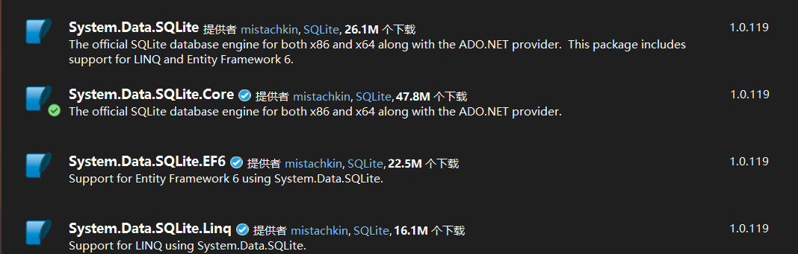
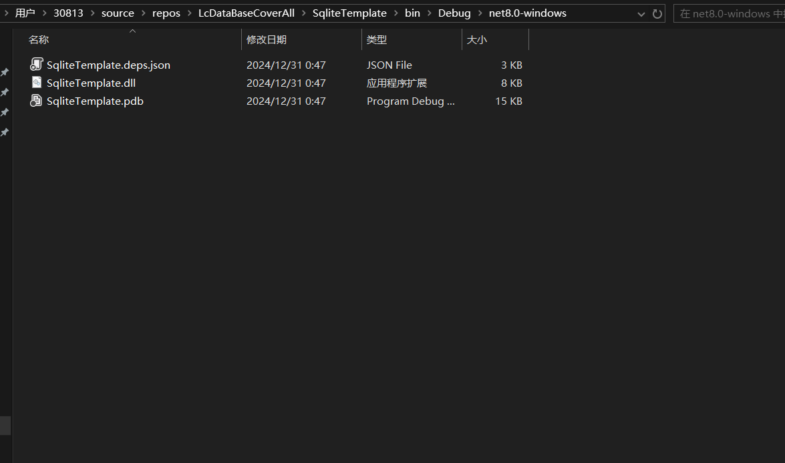
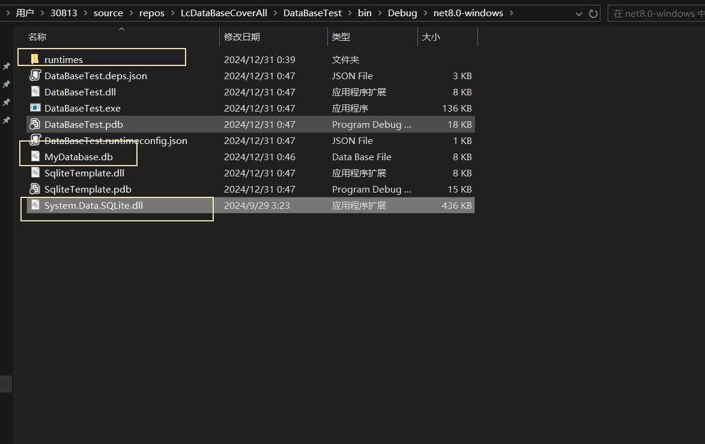
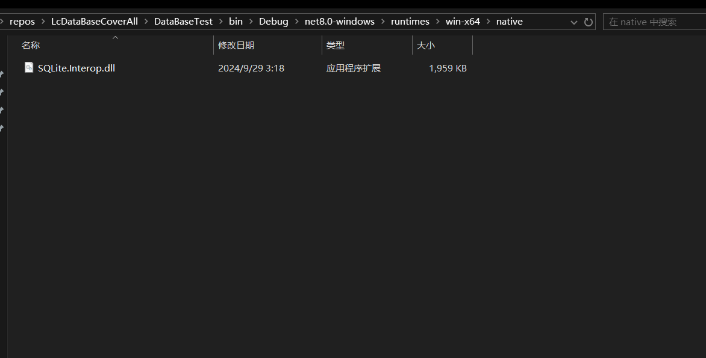
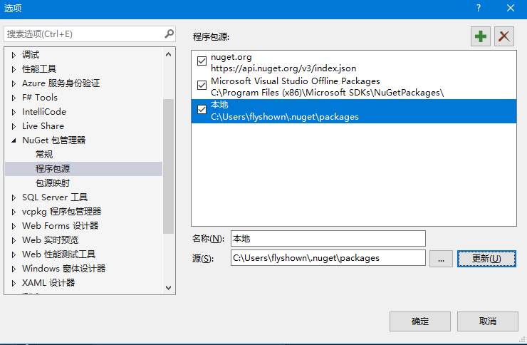
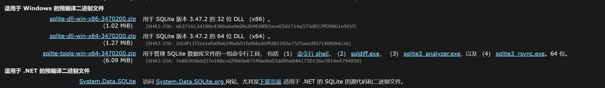
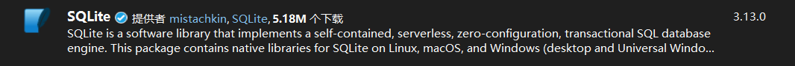
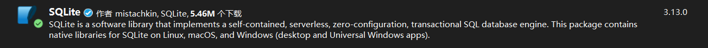



# 作废笔记

参考网址1：[sqlite和sqlite3|极客教程](https://geek-docs.com/sql/sql-ask-answer/327_hk_1708787443.html)

参考网址2：[SQLite – Java | 菜鸟教程](https://www.runoob.com/sqlite/sqlite-java.html)

**可视化操作软件**

[SQLite 管理 |SQLite 专家](https://www.sqliteexpert.com/download.html)

参考博客1：[C#操作SQLite数据库 - springsnow - 博客园](https://www.cnblogs.com/springsnow/p/13072915.html)

参考博客2：

[SQLite](https://geek-docs.com/sqlite/sqlite-top-articles/1000100_sqlite_index.html) 是一种轻量级的关系型数据库管理系统，它在很多移动端应用和嵌入式设备中被广泛使用。SQLite3 则是 [SQLite](https://geek-docs.com/sqlite/sqlite-top-articles/1000100_sqlite_index.html) 的一个稳定版本，本文将深入探讨 SQLite 和 SQLite3 的用法、特性和区别。

## SQLite简介

SQLite 是一种自包含、零配置的 [SQL](https://geek-docs.com/sql/sql-top-tutorials/1000100_sql_index.html) 数据库引擎。它不需要服务器来运行，直接读取和写入普通的磁盘文件。因此，SQLite 在移动应用、嵌入式设备和小型应用程序中被广泛应用。

### SQLite的优点

1. 轻量级：SQLite 非常小巧，数据库文件可以轻松地嵌入到应用中。
2. 无需配置：无需安装和配置单独的服务器，可以直接使用。
3. 支持事务：SQLite 支持事务处理，可以确保数据的完整性和一致性。
4. 跨平台：支持多种操作系统，包括 Windows、Mac、Linux 等。

### SQLite的缺点

1. 不适用于高并发：在高并发环境下，SQLite 的性能可能会受到影响。
2. 所有客户端直接访问数据库文件：不适合多用户同时修改数据的场景。
3. 功能相对简单：与一些大型数据库相比，SQLite 的功能相对简单。

### SQLite语法

SQLite 支持标准的 [SQL](https://geek-docs.com/sql/sql-top-tutorials/1000100_sql_index.html) 语法，包括创建表、插入数据、查询数据、更新数据和删除数据等操作。下面是一些基本的 SQL 语句示例：

```sql
-- 创建表
CREATE TABLE users (
    id INTEGER PRIMARY KEY,
    name TEXT,
    age INTEGER
);

-- 插入数据
INSERT INTO users (name, age) VALUES ('Tom', 25);

-- 查询数据
SELECT * FROM users;

-- 更新数据
UPDATE users SET age = 26 WHERE name = 'Tom';

-- 删除数据
DELETE FROM users WHERE name = 'Tom';
```

SQL

Copy

## SQLite3简介

SQLite3 是 SQLite 的一个稳定版本，引入了一些新的特性，并改进了一些功能。SQLite3 和 SQLite 在语法上基本一致，但在使用上略有不同。

### SQLite3的优点

1. 支持更多数据类型：SQLite3 支持更多的数据类型，如 BOOLEAN、FLOAT、DOUBLE 等。
2. 支持更多的SQL功能：SQLite3 支持 WINDOW 函数、GENERATED 列等新功能。
3. 更好的性能优化：SQLite3 在性能上有一些优化，使得查询和操作更加高效。
4. 改进了一些功能：如支持外部模块、允许并发读取等。

### SQLite3的缺点

1. 对比SQLite，SQLite3 的内存占用稍高一些。
2. 由于增加了一些新的功能，有时候会导致兼容性问题。

### SQLite3的用法

SQLite3 的用法与 SQLite 类似，主要区别在于一些语法上的改变。比如在创建表的时候，可以使用新的数据类型：

```sql
CREATE TABLE users (
    id INTEGER PRIMARY KEY,
    name TEXT,
    age INTEGER,
    is_active BOOLEAN
);
```

SQL

Copy

在查询数据时，可以使用 WINDOW 函数来进行排序和分组：

```sql
SELECT name, age, ROW_NUMBER() OVER (ORDER BY age) AS row_num FROM users;
```

SQL

Copy

## SQLite和SQLite3的不同

1. 版本不同：SQLite 是早期版本，SQLite3 是新版本，引入了一些新的特性。
2. 数据类型支持不同：SQLite3 支持更多的数据类型，如 BOOLEAN、FLOAT 等。
3. SQL功能不同：SQLite3 支持 WINDOW 函数、GENERATED 列等新功能。
4. 性能优化不同：SQLite3 在性能上有一些优化，比较有赞。

## 结论

SQLite 和 SQLite3 都是轻量级、易用的关系型数据库管理系统，适用于小型应用和嵌入式系统。选择使用哪一个取决于具体的需求和情况，如果需要更多的数据类型和功能，可以选择使用 SQLite3。在实际使用中，可以根据项目的具体情况来选择合适的版本。


## 使用方式

只需要安装System.Data.Sqlite



System.Data.SQLite：是最全面的部分。

下面装的是System.Data.SQLite.Core

引用System.Data.Sqlite的类库项目



使用这个类库的项目



runtimes目录下的文件



**小技巧：Nuget包在没网的情况下，怎么引用自己电脑上已经有的**



**小技巧：怎么查看一个文件的依赖项**

1. dumpbin.exe

   vs2022路径：vs2022\VC\Tools\MSVC\14.40.33807\bin\Hostx64\x86

   使用方式：dumpbin /dependents StrainToDisplacement.dll

2. 第三方工具：[win10依赖查找工具 Dependencies Dependency Walker](https://www.cnblogs.com/youxin/p/15737032.html)（https://github.com/lucasg/Dependencies）

## 刚开始不清楚Sqlite3.dll是干什么用的

sqlite3.dll可能是C++的，包括Nuget安装包





# Sqlite笔记（[SQLite 主页](https://www.sqlite.org/index.html)）

官网链接：[SQLite Home Page](https://www.sqlite.org/index.html)

## 类库区别

|        **特性**        |     **System.Data.SQLite**     | **Microsoft.Data.Sqlite** | **Mono.Data.Sqlite** |
| :--------------------: | :----------------------------: | :-----------------------: | :------------------: |
|      **支持框架**      | .NET Framework 2.0+、.NET Core |  .NET Core 2.0+、.NET 5+  |      Mono 2.0+       |
|   **ADO.NET 完整性**   |     完整支持（含 DataSet）     |  部分支持（无 DataSet）   |      仅基础功能      |
| **Visual Studio 工具** |         集成图形化工具         |            无             |          无          |
|      **加密功能**      |              支持              |      需第三方库扩展       |        不支持        |
|      **性能优化**      |     事务批量写入、索引优化     | 轻量级设计，默认性能更优  |      无特殊优化      |
|    **代码示例对比**    |          复杂参数绑定          |   简洁的 Lambda 表达式    |   类似旧版 ADO.NET   |

------

**NuGet页面支持C++和C#的包下载——这个是错误的，VS应该会根据编程语言区分**

- `System.Data.SQLite`旧版 SQLite 的 NuGet 包，包含完整的托管代码和原生二进制文件（`x86/x64`）。已被拆分为 `System.Data.SQLite.Core` 和其他扩展包，​**不再推荐使用**。仅用于维护遗留项目。

- SQLite应该就是给C语言用的，但是C#能调用C的dll,所有NuGet才能下，C语言是跨平台的，可以使用这个类库去实现跨平台。

  

|                **包名**                | **维护方**  |           **目标框架**           |           **主要用途**            |                **推荐场景**                 |
| :------------------------------------: | :---------: | :------------------------------: | :-------------------------------: | :-----------------------------------------: |
|       `System.Data.SQLite.Core`        | SQLite 团队 | .NET Framework 4.6+ .NET Core/5+ | 直接操作 SQLite 数据库（ADO.NET） |        旧版 .NET Framework 桌面应用         |
|        `System.Data.SQLite.EF6`        | SQLite 团队 |       .NET Framework 4.6+        |       在 EF6 中使用 SQLite        |           旧版 WPF/WinForms + EF6           |
|        `Microsoft.Data.Sqlite`         |    微软     |        .NET Standard 2.0+        |   跨平台 SQLite 操作（ADO.NET）   |      ASP.NET Core、Xamarin、MAUI 应用       |
| `Microsoft.EntityFrameworkCore.Sqlite` |    微软     |      .NET Core 3.1+ .NET 5+      |     在 EF Core 中使用 SQLite      | 现代跨平台应用（如 ASP.NET Core + EF Core） |

------

